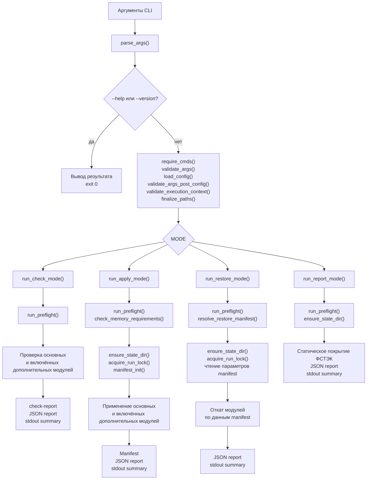
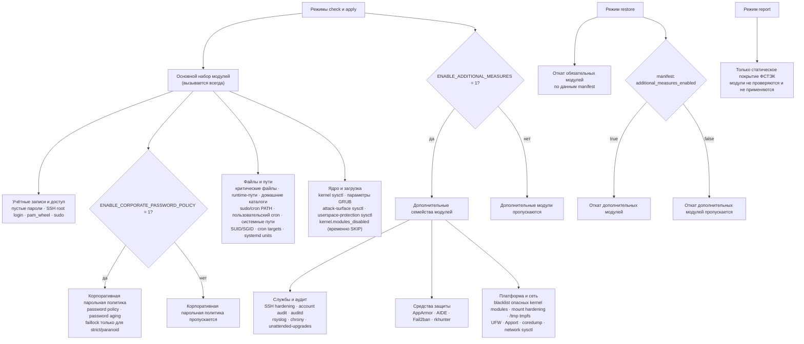
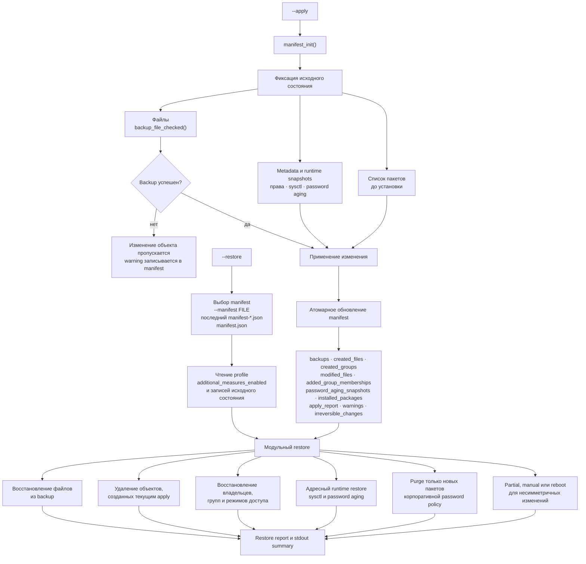

# Архитектура SecureLinux-NG

## Назначение

SecureLinux-NG — framework для безопасной настройки Linux-хостов с опорой на требования и рекомендации ФСТЭК, с обязательной проверкой совместимости до применения изменений, фиксацией действий в manifest/report и контролируемым откатом там, где это возможно.

Дополнительные меры отделены от основного набора hardening и по умолчанию отключены. Для текущего запуска `--apply` они включаются CLI-флагом `--enable-additional-measures` либо параметром `ENABLE_ADDITIONAL_MEASURES=1` в config-файле. CLI-флаг имеет высший приоритет.

## Текущая версия: 16.2.11

Framework реализован; в проектном реестре реализованы 59 из 60 позиций. История изменений по версиям — в CHANGELOG.md.

## Среда выполнения

Основной скрипт задаёт системный `PATH`: `/usr/local/sbin:/usr/local/bin:/usr/sbin:/usr/bin:/sbin:/bin`.

Это исключает зависимость от пользовательского `PATH` и обеспечивает обнаружение `visudo`, `sysctl` и других административных команд на Debian.

## Основные режимы

Поддерживаемые режимы:
- `--help`
- `--version`
- `--check`
- `--apply`
- `--restore`
- `--report`

Поддерживаемые опции framework-уровня:
- `--dry-run`
- `--enable-additional-measures` — включает дополнительные модули только для `--apply`
- `--profile=baseline|strict|paranoid`
- `--config <file>`
- `--manifest <file>` — явный manifest для `--restore`

## Общая схема выполнения

Схема отражает фактический поток `main()`. Режимы `--help` и `--version`
завершаются непосредственно в `parse_args()` и не переходят к основным режимам.

## Карта модулей усиления безопасности

Группировка ниже отражает назначение модулей. Точный порядок вызовов задаётся
функциями `run_check_mode()`, `run_apply_mode()` и `run_restore_mode()`.

## Поток apply, manifest и restore

Для операций, поддерживающих автоматический откат, до изменения сохраняется
исходное состояние. Manifest обновляется атомарно и связывает restore с backup,
снимками состояния и объектами, созданными текущим apply.

## Модель профилей

Проект использует три профиля:
- `baseline`
- `strict`
- `paranoid`

Назначение профилей:
- `baseline` — минимально необходимый и максимально совместимый уровень;
- `strict` — усиленный уровень с большим количеством ограничений;
- `paranoid` — максимально жёсткий профиль, допускающий дополнительные compatibility-ограничения.

## Модель конфигурации

Приоритет источников конфигурации:
1. defaults внутри скрипта;
2. внешний config file;
3. CLI overrides.

CLI `--profile` всегда имеет приоритет над значением из config-файла через `_PROFILE_SET_BY_CLI`. CLI-флаг `--enable-additional-measures` устанавливает `_ADDITIONAL_MEASURES_SET_BY_CLI=1` и не может быть выключен значением `ENABLE_ADDITIONAL_MEASURES=0` из config-файла.

Ключевые параметры:

- `PROFILE` — профиль `baseline`, `strict` или `paranoid`;
- `STATE_DIR`, `REPORT_FILE` — пути manifest, backup, логов и отчёта;
- `ENABLE_CORPORATE_PASSWORD_POLICY` — включает дополнительную корпоративную парольную политику; по умолчанию `0`;
- `ENABLE_ADDITIONAL_MEASURES` — включает дополнительные меры; по умолчанию `0`; CLI-флаг `--enable-additional-measures` имеет приоритет;
- `WHEEL_USERS` — необязательный явный список существующих администраторов для безопасного включения `pam_wheel`; при пустом значении обычный запуск через `sudo` использует проверенного `SUDO_USER`;
- `USER_NAMESPACES_LIMIT` — значение `user.max_user_namespaces`;
- `UFW_EXTRA_RULES` — дополнительные разрешения UFW вида `порт/протокол:комментарий`; правила применяются без ограничения по адресу источника.

## Блокировки apt/dpkg

Установка пакетов выполняется синхронно. Перед пакетной операцией скрипт проверяет:

- `/var/lib/dpkg/lock-frontend`;
- `/var/lib/dpkg/lock`;
- `/var/cache/apt/archives/lock`.

Владелец определяется через `fuser`, а при его отсутствии — через `lslocks`. Скрипт ждёт фактического освобождения блокировки и не завершает чужие процессы. `DPkg::Lock::Timeout=300` дополнительно защищает от гонки непосредственно перед запуском `apt-get`.

Минимально поддерживаемые ключи config:
- `PROFILE`
- `STATE_DIR`
- `REPORT_FILE`
- `MANIFEST_FILE`
- `USER_NAMESPACES_LIMIT`
- `ENABLE_CORPORATE_PASSWORD_POLICY`
- `ENABLE_ADDITIONAL_MEASURES`
- `WHEEL_USERS`
- `UFW_EXTRA_RULES` — список правил вида `порт/протокол:комментарий`, разделённых пробелами

Требования к config:
- формат `KEY=VALUE`;
- пустые строки и комментарии допустимы;
- неизвестные ключи не должны ломать выполнение, но должны отражаться как warning.

## Preflight / compatibility model

Перед применением hardening-мер должен выполняться preflight-анализ среды.

Минимум, что должен определять preflight:
- семейство ОС;
- версия ОС;
- container / non-container;
- desktop / server-like environment;
- Docker;
- Podman;
- Kubernetes node.

Результат preflight должен раскладываться минимум на 4 категории:
- `safe`
- `risky`
- `skipped`
- `requires_confirmed_policy`

Принцип:
- framework не должен молча применять потенциально опасные меры;
- сомнительные меры маркируются через `policy_gate` — запись в отчёт с предупреждением;
- автоматического запрета мер по среде нет: решение о применении остаётся за администратором.

## Manifest model

Manifest должен быть машинно-читаемым и пригодным для restore/report.

Все записи в manifest выполняются атомарно (temp file + `fsync` + `os.replace`), чтобы прерывание процесса не могло повредить JSON.

Минимальные поля manifest:
- `version`
- `profile`
- `mode`
- `timestamp`
- `backups`
- `created_files`
- `created_groups`
- `modified_files`
- `systemd_units`
- `sysctl_configs`
- `grub_backups`
- `apply_report`
- `additional_measures_enabled`
- `installed_packages`
- `added_group_memberships`
- `password_aging_snapshots`
- `warnings`
- `irreversible_changes`

## Restore model

Restore в SecureLinux-NG должен опираться не на догадки, а на manifest.

Restore-модель должна предполагать:
- восстановление изменённых файлов из backup;
- удаление созданных файлов;
- удаление созданных групп;
- удаление созданных systemd unit/drop-in;
- удаление созданных sysctl drop-in;
- восстановление исходных runtime sysctl-значений из snapshot, сохранённого перед apply;
- отдельную маркировку действий, которые автоматически неоткатны.

Restore-модель не является полностью симметричной для всех мер:
- часть изменений откатывается только частично;
- часть изменений требует ручных действий;
- часть runtime-эффектов не должна восстанавливаться автоматически по соображениям безопасности.

Примеры асимметричного restore:
- пакеты дополнительных модулей (`rkhunter`, `unattended-upgrades`, `chrony`, `rsyslog`) не удаляются автоматически; исключение — зависимости корпоративной парольной политики, впервые установленные текущим apply и записанные в `installed_packages`;
- для заранее активного UFW restore остаётся partial и не откатывает исходные правила автоматически;
- пустые поля пароля в `/etc/shadow` не восстанавливаются автоматически по соображениям безопасности;
- `kernel.kexec_load_disabled=1` является write-once и не возвращается в `0` без перезагрузки.

Если откат невозможен, это должно быть явно отражено в manifest/report.

При повторном `--apply` с существующим manifest — администратор подтверждает продолжение, после чего существующий manifest архивируется в `.bak-<timestamp>` и создаётся новый.

## Report model

После `--check`, `--apply`, `--restore` и `--report` должен существовать единый формат итогового report.

Минимальные разделы report:
- версия;
- профиль;
- режим;
- сведения о среде;
- `safe`;
- `risky`;
- `skipped`;
- `requires_confirmed_policy`;
- `warnings`;
- `errors`.

На этапе dry-run report может не писаться на диск, но summary должен печататься в stdout.

## Защита от параллельного запуска

Режимы `--apply` и `--restore` защищены через `flock` (`acquire_run_lock`). При обнаружении параллельного экземпляра — немедленное завершение с ошибкой.

## Гарантия backup при apply

Все backup-операции перед перезаписью конфигов выполняются через `backup_file_checked()` с проверкой успеха `cp`. Если backup не удался (диск заполнен, ошибки I/O) — модуль пропускается, а не продолжает с потерянным оригиналом. Это критично для PAM, SSH, sudoers, sysctl dropin-файлов.

## Атомарная запись критичных файлов

Модификация `/etc/shadow` (блокировка пустых паролей) выполняется через атомарную запись: temp file + `fsync` + `os.replace`, чтобы аварийное завершение не могло повредить файл аутентификации.

## Повторное применение сетевых sysctl после network-online

`systemd-sysctl` применяет `/etc/sysctl.d/*.conf` на раннем этапе загрузки.
После этого NetworkManager, systemd-networkd, cloud-init, VPN, контейнерные
платформы и другие сетевые компоненты могут создать или повторно поднять
интерфейсы и изменить параметры `/proc/sys/net/*`.

Поэтому SecureLinux-NG создаёт oneshot-unit:

`/etc/systemd/system/securelinux-ng-sysctl.service`

Unit запускается после `network-online.target` и выполняет только:

`/sbin/sysctl -p /etc/sysctl.d/62-securelinux-ng-network.conf`

Глобальный `sysctl --system` не используется. Параметры других приложений и
чужие sysctl drop-in-файлы повторно не применяются.

Состояние `active (exited)` является нормальным для `Type=oneshot` с
`RemainAfterExit=yes`: команда уже успешно выполнена, постоянно работающий
процесс не требуется.

Без этого unit или эквивалентного hook-механизма нельзя гарантировать, что
сетевые параметры hardening сохранятся после завершения настройки сети и
создания дополнительных интерфейсов.

Возможные альтернативы — dispatcher-скрипты NetworkManager, hooks
systemd-networkd или отдельные обработчики конкретного сетевого стека.
Отдельный systemd-unit выбран как единый механизм для поддерживаемых Debian
и Ubuntu независимо от используемого сетевого менеджера.

## Изолированная модель sysctl

Каждый sysctl-модуль применяет только собственный managed drop-in через `sysctl -p <file>`. Глобальный `sysctl --system` не используется.

Перед применением сохраняются текущие live-значения параметров в `sysctl-runtime-<module>-<timestamp>.json`. Путь к snapshot фиксируется в `apply_report` manifest. При restore значения возвращаются адресно через `sysctl -w`.

Исключение: write-once параметры ядра, включая `kernel.kexec_load_disabled`, могут не восстановиться до перезагрузки и поэтому имеют статус `partial`.

## Dry-run model

`--dry-run` допустим только вместе с `--apply`.

В dry-run framework обязан:
- ничего не менять в системе;
- показывать, что было бы создано;
- показывать, что было бы изменено;
- показывать, какие артефакты manifest/report были бы созданы;
- печатать итоговую summary без требования реального наличия report-файла.

## Разделение framework и hardening

Правило проекта: framework и hardening не смешивать. Все шесть этапов разработки пройдены: framework, preflight, config/report/manifest, hardening-модули, coverage checks, restore verification.

## Группы hardening-модулей

### Реализованы
1. **identity / auth / PAM / SSH** — обязательные 2.1.1 и 2.1.2, SSH hardening, 2.2.1 с администраторами из явного `WHEEL_USERS` либо проверенного `SUDO_USER`, 2.2.2; опционально по `ENABLE_CORPORATE_PASSWORD_POLICY=1`: faillock, pwquality, login.defs, `chage` с manifest-снимком aging и нормализация `common-password`
2. **file permissions / ownership** — 2.3.1–2.3.11
3. **kernel / sysctl / boot** — 2.4.x, 2.5.x, 2.6.x, GRUB apply
4. **audit** — auditd baseline (identity, sudo, sshd, modules, privileged, network bind/connect, usb_devices) + extended
5. **firewall** — UFW
6. **mount hardening** — /tmp tmpfs, /dev/shm, /var/tmp
7. **kernel modules** — blacklist неиспользуемых ФС и протоколов
8. **intrusion detection** — fail2ban, AIDE, rkhunter
9. **mandatory access control** — AppArmor enforce
10. **reporting** — account audit, coverage report
11. **network hardening** — sysctl network (ip_forward, log_martians, rp_filter, redirects, tcp_syncookies, icmp_echo_ignore_broadcasts, icmp_ignore_bogus_error_responses, tcp_syn_retries)
12. **core dumps** — limits.d + systemd coredump.conf + kernel.core_pattern sysctl dropin

## Трассировка требований

Каждый hardening-блок должен иметь:
- ссылку на пункт ФСТЭК;
- статус покрытия;
- проверку результата;
- отражение в `docs/fstec-mapping.md`.

Блок не считается реализованным окончательно без:
- кода;
- проверки;
- отражения в mapping.

## Структура main()

Порядок вызовов в `main()`:
1. `parse_args` — разбор CLI (включая `--help`/`--version`, которые завершаются сразу);
2. `require_cmds` — проверка наличия обязательных команд;
3. `validate_args` — проверка аргументов;
4. `load_config` — загрузка внешнего config;
5. `validate_args_post_config` — проверка профиля после загрузки конфига;
6. `validate_execution_context` — проверка root для apply/restore;
7. `finalize_paths` — вычисление путей report/manifest/log.

`--help` и `--version` работают без проверки наличия системных команд.

## Документационный принцип

Для SecureLinux-NG порядок должен быть таким:
1. сначала фиксируется архитектура;
2. затем меняется код;
3. затем добавляются тесты;
4. затем обновляются README / CHANGELOG / mapping.

## Report coverage model

Итоговый `report` должен включать не только среду и warnings/errors, но и отдельный блок покрытия ФСТЭК:
- `fstec_items`
- `fstec_summary`

Это позволяет видеть текущий фактический объём реализованных модулей без чтения `docs/fstec-mapping.md`.

## Уточнения архитектуры v16.2.11

### Gate дополнительных мер

Обычный `--apply` сохраняет безопасное значение `ENABLE_ADDITIONAL_MEASURES=0` и выполняет основной набор hardening без дополнительного блока.

CLI-флаг `--enable-additional-measures` допустим только вместе с `--apply`, имеет приоритет над config-файлом и включает 17 модулей:

1. расширенное укрепление SSH;
2. аудит учётных записей;
3. AppArmor;
4. AIDE;
5. fail2ban;
6. rkhunter;
7. отключение опасных модулей ядра;
8. укрепление параметров монтирования;
9. защищённый `/tmp` как `tmpfs`;
10. UFW;
11. auditd и правила аудита;
12. rsyslog;
13. chrony;
14. unattended-upgrades;
15. отключение apport;
16. ограничение core dump;
17. дополнительные сетевые sysctl.

Фактическое состояние сохраняется в manifest-поле `additional_measures_enabled`. При запуске с CLI-флагом записывается `true`, без него и при значении config `0` — `false`.

Если apply выполнялся со значением `false`, restore пропускает дополнительные модули, которые не применялись. Для старых manifest без этого поля используется совместимое прежнее поведение полного restore дополнительных модулей.

### Точное отслеживание зависимостей password policy

Перед установкой зависимостей скрипт сохраняет полный список
установленных пакетов. После `apt-get install` разница записывается
в `installed_packages` с модулем `password-policy`.

При restore сначала удаляются только записанные новые пакеты,
после чего восстанавливаются `pwquality.conf`, `login.defs`,
`common-password` и password aging.

Состояние `/etc/security/pwquality.conf` фиксируется до установки
зависимостей, поскольку `libpwquality-common` способен создать файл.

### Сохранение более строгих sysctl

Для `kernel.perf_event_paranoid`,
`kernel.unprivileged_bpf_disabled` и `vm.mmap_min_addr`
apply не понижает уже действующее более строгое числовое значение.
Check считает равное или более строгое значение соответствующим.

### Restore GRUB

Backup создаётся для `/etc/default/grub`. После восстановления
выполняется `update-grub` или `grub2-mkconfig`.

Функциональная конфигурация и активная командная строка ядра после
reboot возвращаются к исходным, но generated-файл
`/boot/grub/grub.cfg` не резервируется и не обязан совпадать побайтово.
