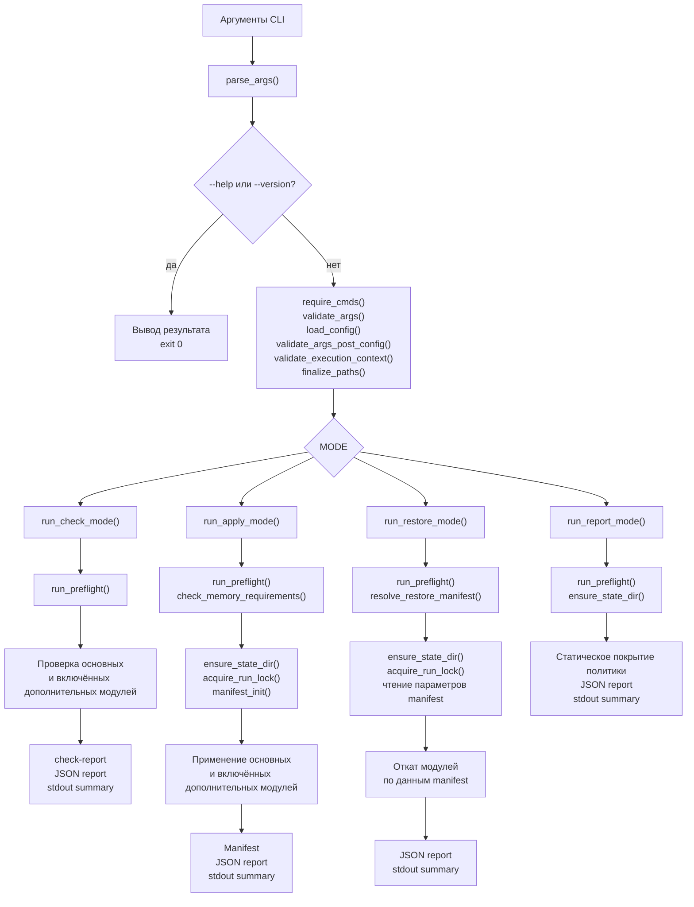
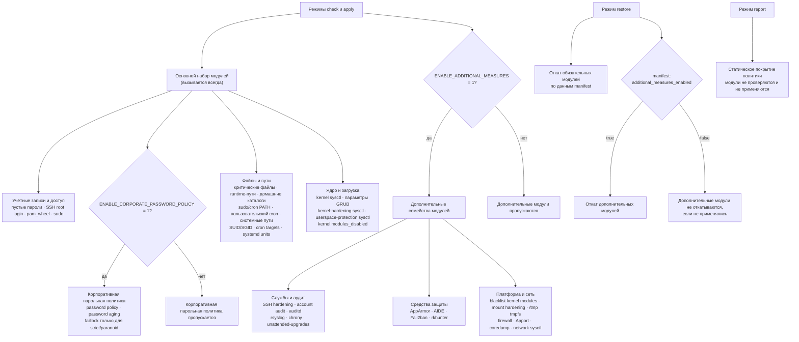
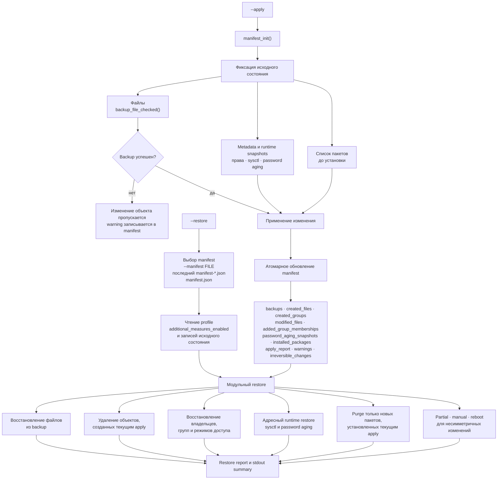

# Важно: это donor runtime reference, а не основная карта v3

Основная карта текущего SecureLinux-Policy v3:
[`PROJECT-MAP-v3.md`](PROJECT-MAP-v3.md).

Схемы ниже сохранены как полезная целевая runtime-модель из старого
SecureLinux-NG. Они не описывают текущую структуру v3 целиком и не являются
источником статуса проекта.

---

# SecureLinux-Policy v3 — визуальная архитектура

> **Статус:** целевая runtime-архитектура, сохранённая из инженерного донора
> SecureLinux-NG. Она сохранена как donor evidence и **не закрепляет RESTORE как цель v3**.
>
> Эти схемы не утверждают, что все показанные runtime-механизмы уже реализованы
> в v3. Их перенос идёт через `DONOR_TO_V3_MAPPING`. Будущий v3 runtime имеет
> только APPLY semantic contract; показанные ниже RESTORE-ветви являются
> историческими donor-механизмами и не входят в целевую архитектуру.
>
> GitHub отрисовывает блоки `mermaid` ниже как диаграммы.

## 1. CLI и основные режимы

## 2. Модули, дополнительные меры и restore

## 3. Apply → manifest → restore

## Текущее место в проекте

Эти donor runtime diagrams не являются источником текущего статуса.
Актуальная primary-карта — [`PROJECT-MAP-v3.md`](PROJECT-MAP-v3.md), а
машинный macro-roadmap — `ROADMAP-v3.tsv`.

До открытия `APPLY semantic contract` показанные APPLY-ветви остаются donor/future
reference. Показанные RESTORE-ветви — только историческая donor reference:
пользовательский RESTORE в v3 не планируется, post-APPLY recovery выполняется
внешним snapshot rollback.
