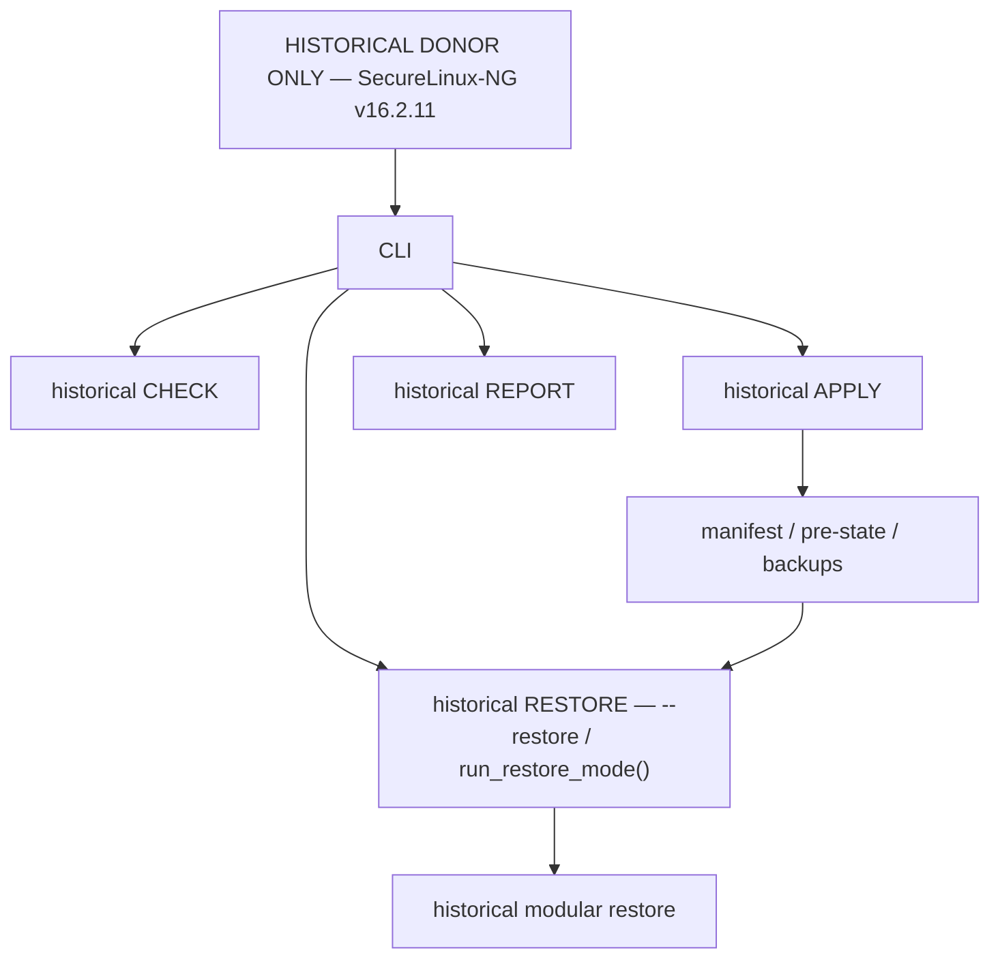
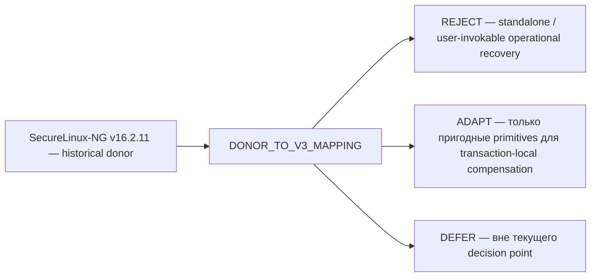

# SecureLinux-Policy v3 — исторический справочник runtime-архитектуры донора

Основная карта текущего состояния проекта:
[`PROJECT-MAP-v3.md`](PROJECT-MAP-v3.md).

Этот документ — **historical donor runtime reference**. Он не является current
project map, не является future target model и не является источником статуса
реализации v3. Его задача — сохранить проверяемую инженерную историю донора и
показать границу между historical mechanics и принятыми решениями v3.

Исторический donor `SecureLinux-NG` содержал полноценный standalone operational-контур
RESTORE: отдельный CLI `--restore`, `run_restore_mode()`, выбор manifest/backups,
модульное восстановление и специализированные regression-тесты. Это был реально
реализованный механизм донора, а не stub. В v3 этот operational-контур целиком не
переносится: он сохраняется как historical donor evidence в `archive/**` и
`DONOR_TO_V3_MAPPING`; отдельные доказанные primitives могут использоваться только
через `ADAPT` для transaction-local compensation внутри failed/uncommitted APPLY.

Принятые границы v3:

- `RESTORE_OPERATIONAL_CONTOUR=EXCLUDED`;
- `POST_APPLY_RECOVERY_MODEL=EXTERNAL_SNAPSHOT`;
- `TRANSACTION_LOCAL_COMPENSATION=FAILED_UNCOMMITTED_APPLY_ONLY`;
- `--report` — human-readable CHECK report с runtime route
  `slp_run_check pretty 1 REPORT`;
- metadata/provenance обслуживаются `--build-info` и `--provenance`, а не REPORT.

## 1. Исторический runtime-контур SecureLinux-NG

Эта схема описывает только фактически существовавший donor runtime. Она не
предлагает RESTORE как current или future contour v3.

## 2. Historical donor → `DONOR_TO_V3_MAPPING`

Для RESTORE-related subset mapping механически проверяет 68 function rows:
`REJECT 45 / ADAPT 16 / DEFER 7`; `run_restore_mode` относится к `REJECT`.
Эти числа относятся к принятому immutable mapping checkpoint и проверяются
напрямую по `DONOR-TO-V3-MAPPING.tsv`, а не используются как live project counts.

## Граница с v3

В v3 standalone/user-invokable/post-APPLY operational RESTORE исключён. После
успешного APPLY SecureLinux-Policy не выполняет встроенное восстановление среды:
если требуется вернуть окружение к прежнему состоянию, используется внешний
snapshot/backup-механизм вне продукта. Внутренняя компенсация допустима только
для `FAILED_UNCOMMITTED_APPLY` и только в пределах mutation текущей попытки.

Текущий substantive checkpoint, порядок будущих стадий и статус реализации
определяются только [`PROJECT-MAP-v3.md`](PROJECT-MAP-v3.md) и
`ROADMAP-v3.tsv`; этот historical reference их не дублирует и не заменяет.
