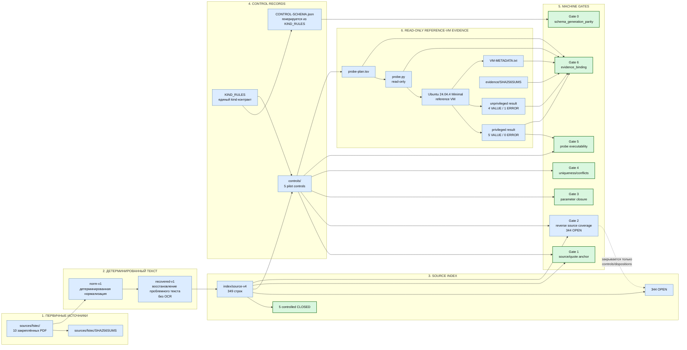
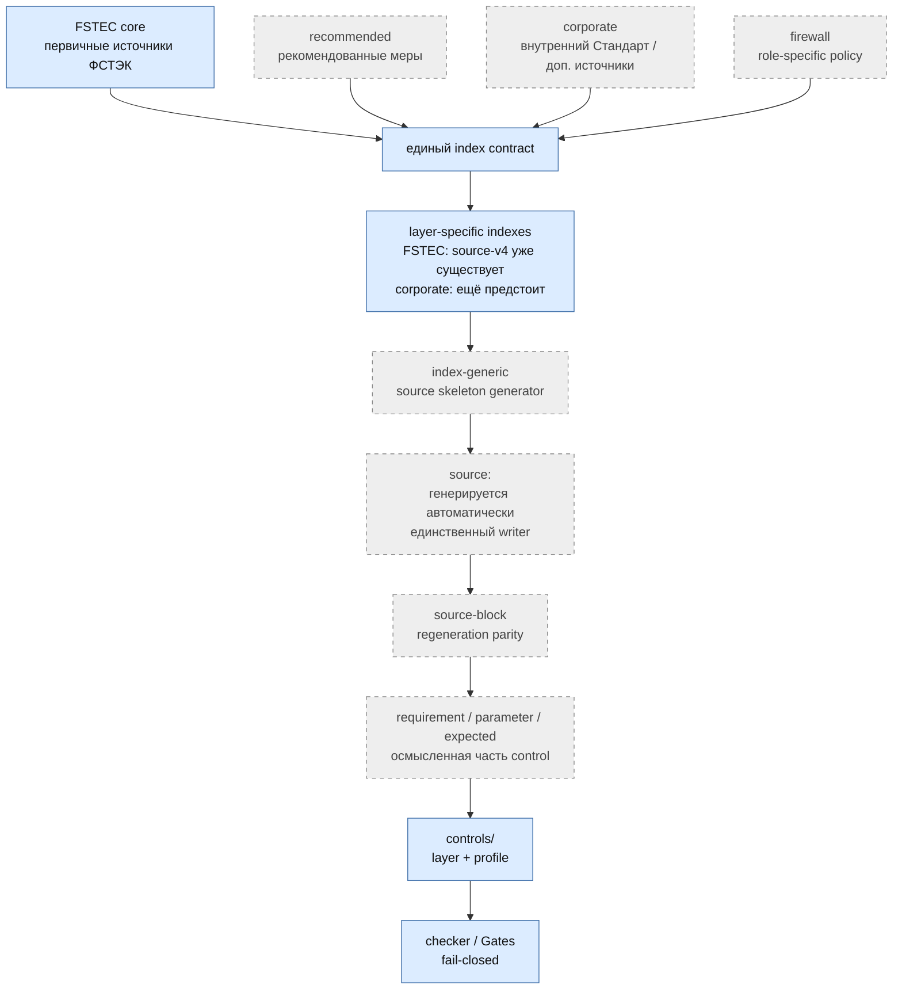
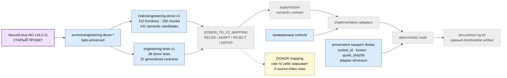

# SecureLinux-Policy v3 — карта проекта и взаимодействий

> **Это основная архитектурная карта текущего SecureLinux-Policy v3.**
>
> Она показывает действующие источники истины, индексы, controls, Gates,
> reference-VM evidence, policy layers, engineering donor и путь к конечному
> `securelinux-ng.sh`.
>
> Старый SecureLinux-NG здесь присутствует только как **engineering donor**.
> Его runtime-архитектура не является архитектурой v3 и не закрывает
> нормативные строки автоматически.

## Легенда

- зелёный — закрытый этап/гейт;
- **оранжевый — единственное текущее место работы**;
- серый — будущий этап;
- синий — действующий структурный компонент;
- фиолетовый — engineering donor.

## 1. Как устроен проект v3 сейчас

## 2. Слои политики и единый конвейер

## 3. Engineering donor и путь к runtime

## 4. Где мы находимся

```mermaid
flowchart LR
    S1["Step 5<br/>audit provenance closure"]:::closed
    S2["Gate 6<br/>evidence_binding"]:::closed
    S3["МЫ ЗДЕСЬ<br/>type/boolean<br/>contract cleanup"]:::current
    S4["mandatory real-jsonschema<br/>release gate"]:::future
    S5["index-generic<br/>source skeleton generator"]:::future
    S6["source-block<br/>regeneration parity"]:::future
    S7["FSTEC + corporate<br/>index expansion / dispositions"]:::future
    S8["apply/restore<br/>semantic contract"]:::future
    S9["implementation<br/>adapters"]:::future
    S10["deterministic<br/>build"]:::future
    S11["single distributable<br/>securelinux-ng.sh"]:::future

    S1 --> S2 --> S3 --> S4 --> S5 --> S6 --> S7 --> S8 --> S9 --> S10 --> S11

    classDef closed fill:#d9f7df,stroke:#2f7d32,color:#111,stroke-width:2px;
    classDef current fill:#ffe2a8,stroke:#c77800,color:#111,stroke-width:4px;
    classDef future fill:#eeeeee,stroke:#888,color:#444,stroke-dasharray: 5 5;
```

## Что является источником истины

Финальный `securelinux-ng.sh` не редактируется вручную. Он должен получаться
детерминированной сборкой из проверенных нормативных controls, инженерных
semantic contracts, implementation adapters и tests.

То есть направление проекта:

`источник → index → control → gates → semantic contract → adapter → build → script`

а не:

`старый shell-скрипт → правки вручную → новый shell-скрипт`.
