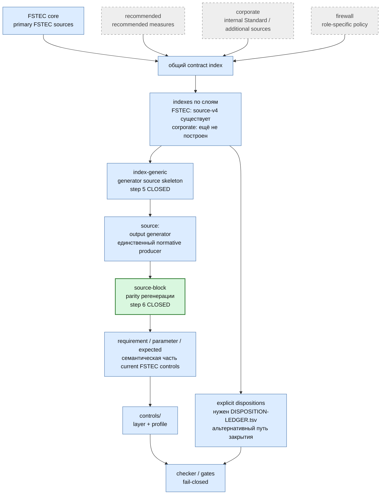
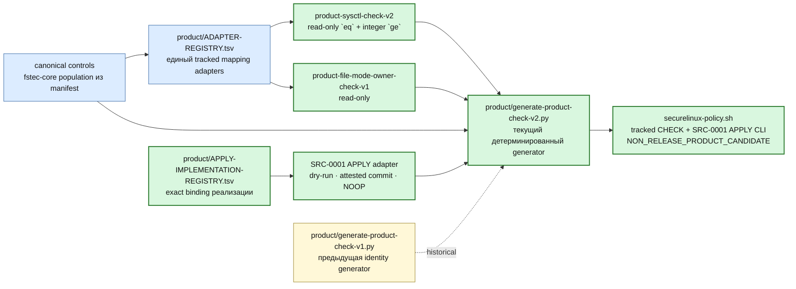
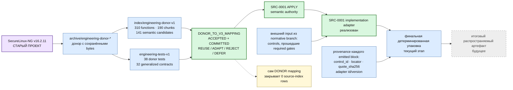
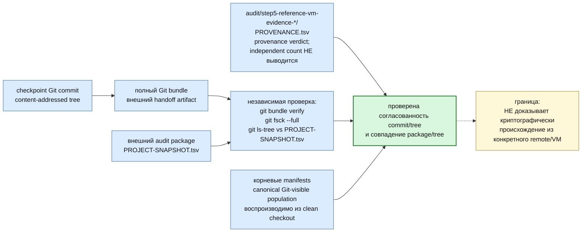

# SecureLinux-Policy v3 — карта проекта и взаимодействий

> **Это основная архитектурная карта текущего SecureLinux-Policy v3.**
>
> Карта показывает действующие источники истины, текстовые корпуса, source
> index, controls, механические gates, reference-VM evidence, audit provenance,
> policy layers, engineering donor, текущую CHECK + `SRC-0001` APPLY product-line и путь к будущему distributable artifact.
>
> Старый SecureLinux-NG присутствует только как **engineering donor**. Его
> runtime-архитектура не является нормативной архитектурой v3 и сама по себе
> не закрывает source-index rows.

<!-- BEGIN GENERATED MAP STATUS -->
`строки source=349 · controlled CLOSED=40 · OPEN=309 · canonical controls=51 · adapters=18 · target-family=linux-x86_64-supported-v1`

Точные таблицы покрытия: [`docs/fstec-coverage.md`](fstec-coverage.md).
<!-- END GENERATED MAP STATUS -->

Продуктовые правила слоёв: [`docs/policy-layers.md`](policy-layers.md).
Машинно сформированное coverage: [`docs/fstec-coverage.md`](fstec-coverage.md).
Текущая target-совместимость: [`docs/compatibility.md`](compatibility.md).

## Легенда

- зелёный — PASS/CLOSED **в явно указанном текущем scope**;
- серый — будущий этап;
- синий — действующий структурный компонент;
- фиолетовый — engineering donor;
- оранжевый используется **только в разделе «Где мы находимся»** и ровно один
  раз обозначает текущее место работы.

## 1. Источники → текстовые корпуса → index → controls → Gates

```mermaid
flowchart LR
    subgraph SRC["1. ПЕРВИЧНЫЕ ИСТОЧНИКИ"]
        PDF["sources/fstec/<br/>11 закреплённых PDF"]:::component
        PHASH["sources/fstec/SHA256SUMS"]:::component
        PDF --> PHASH
    end

    subgraph TEXT["2. ДВЕ ВЕТКИ ПОЛУЧЕНИЯ НОРМАЛИЗОВАННОГО ТЕКСТА"]
        RAWEXT["raw-pdftotext<br/>обычное извлечение<br/>10 документов"]:::component
        EXNORM["sources/extracted/norm-v1<br/>нормализованный extracted corpus<br/>10 документов"]:::component

        GLYPH["glyph-id-cross-document-v1<br/>PyMuPDF get_texttrace()<br/>ТОЛЬКО 2 документа"]:::component
        RAWREC["raw-glyph-recovered<br/>fstec-linux-2022<br/>fstec-vulnerability-analysis-2025"]:::component
        RECNORM["sources/recovered-v1/norm-v1<br/>нормализованный recovered corpus<br/>2 документа"]:::component

        PDF --> RAWEXT --> EXNORM
        PDF --> GLYPH --> RAWREC --> RECNORM
    end

    subgraph SELECT["3. ВЫБОР КОРПУСА ДЛЯ SOURCE ANCHOR"]
        QUALITY{"селектор корпуса Gate 1<br/>по SOURCE-INDEX.text_quality"}:::component
        EXMAN["sources/extracted/<br/>EXTRACTION-MANIFEST.tsv"]:::component
        RECMAN["sources/recovered-v1/<br/>RECOVERY-MANIFEST.tsv"]:::component

        EXNORM --> EXMAN --> QUALITY
        RECNORM --> RECMAN --> QUALITY
    end

    subgraph INDEX["4. ИНДЕКС ИСТОЧНИКОВ"]
        IDX["index/source-v4<br/>машинная source truth"]:::component
        CLOSED["controlled CLOSED<br/>статус из machine truth"]:::closed
        OPEN["строки OPEN<br/>статус из machine truth"]:::component
        QUALITY --> IDX
        IDX --> CLOSED
        IDX --> OPEN
    end

    subgraph CONTROL["5. CONTROL RECORDS / СХЕМА"]
        CTRL["controls/<br/>current population из manifest"]:::component
        KIND["KIND_RULES<br/>канонический contract parameter-kind"]:::component
        SCHEMA["CONTROL-SCHEMA.json<br/>сгенерировано из KIND_RULES"]:::component
        DIFF["tests/gates-v3/<br/>test_schema_runtime_parity.py<br/>50 records · 16 cases CR/LF<br/>семантика pattern"]:::component
        SEMPAR["schema ↔ runtime<br/>regression семантической parity"]:::component
        REALJSON["Release gate PASS<br/>реальный Draft202012Validator<br/>jsonschema 4.10.3 записан в evidence"]:::closed

        KIND --> SCHEMA
        KIND --> DIFF
        SCHEMA --> DIFF --> SEMPAR --> REALJSON
        IDX --> SGEN["generator source skeleton<br/>step 5 CLOSED · numbered-position<br/>population из manifest"]:::closed
        SGEN --> SPAR["parity source-block<br/>step 6 CLOSED · population из manifest"]:::closed
        SPAR --> CTRL
        KIND --> CTRL
    end

    subgraph GATES["6. МАШИННЫЕ GATES"]
        G0["Gate 0 PASS<br/>schema_generation_parity<br/>только byte-generation parity"]:::closed
        G1["Gate 1 PASS<br/>source/quote anchor<br/>current population manifest"]:::closed
        G2["Gate 2 FAIL<br/>обратное покрытие source<br/>остаются строки OPEN"]:::component
        G3["Gate 3 PASS<br/>закрытие parameters<br/>current population manifest"]:::closed
        G4["Gate 4 PASS<br/>уникальность/конфликты<br/>current population manifest"]:::closed
        G5["Gate 5 historical pilot с admission<br/>5 sysctl controls · 1 reference VM<br/>current запуск без probe — FAIL-closed"]:::component
        G6["Gate 6 PASS — CURRENT EVIDENCE SCOPE<br/>один каталог evidence sysctl-v1"]:::closed

        CLOSURE["index/source-v4/<br/>CLOSURE-CONTRACT.tsv<br/>точный ожидаемый набор controls<br/>для controlled CLOSED rows"]:::component
        DISP["второй путь закрытия:<br/>disposed CLOSED + disposition + reason<br/>нужен DISPOSITION-LEDGER.tsv · 0 реальных rows"]:::component

        SCHEMA --> G0
        IDX --> G1
        CTRL --> G1

        IDX --> G2
        CTRL --> G2
        CLOSURE --> G2
        DISP --> G2

        CTRL --> G3
        CTRL --> G4
        CTRL --> G5
    end

    subgraph EVID["7. READ-ONLY EVIDENCE REFERENCE-VM"]
        PLAN["probes/sysctl-v1/probe-plan.tsv"]:::component
        PROBE["probes/sysctl-v1/probe.py<br/>read-only"]:::component
        VM["Ubuntu 24.04.4 Minimal<br/>reference VM"]:::component
        PRIV["результат privileged<br/>5 VALUE / 0 ERROR"]:::component
        UNPRIV["результат unprivileged<br/>4 VALUE / 1 ERROR"]:::component
        META["VM-METADATA.txt"]:::component
        SUMS["evidence/SHA256SUMS"]:::component

        CTRL --> PLAN --> PROBE --> VM
        VM --> PRIV
        VM --> UNPRIV
        VM --> META

        PRIV --> G5

        META --> G6
        PROBE --> G6
        PLAN --> G6
        PRIV --> G6
        UNPRIV --> G6
        SUMS --> G6
    end

    classDef closed fill:#d9f7df,stroke:#2f7d32,color:#111,stroke-width:2px;
    classDef component fill:#dcecff,stroke:#3e6ea8,color:#111;
    classDef future fill:#eeeeee,stroke:#888,color:#444,stroke-dasharray: 5 5;
```

### Что важно в первой схеме

`recovered-v1` не является продолжением обычного `extracted/norm-v1`.
Восстановление читает PDF отдельным glyph-based путём только для двух
документов, затем отдельно нормализуется в `recovered-v1/norm-v1`.

Одиннадцатый закреплённый PDF — `fstec-order-137-2026-amendments-to-117.pdf` —
image-only authority. Он не включается в обычную `pdftotext`/glyph-recovery
population. Его exact PDF остаётся каноническим источником, page-pinned
визуальная транскрипция хранится в `sources/visual-v1/`, а связь
`fstec-order-117-2025-requirements` → amendment № 137 фиксируется отдельно в
`index/source-v4/FRAMEWORK-AUTHORITY-RELATIONS.tsv`. Эта framework authority
сама по себе не создаёт новые строки `SRC-*` и не переоткрывает
`SRC-0001…SRC-0040`.

Gate 1 выбирает нужный корпус по `SOURCE-INDEX.text_quality`:
`recovered-glyph-map-v1` ведёт через `RECOVERY-MANIFEST.tsv`; обычные readable
rows — через `EXTRACTION-MANIFEST.tsv`.

Gate 0 и differential suite — разные доказательства. Gate 0 проверяет
байтовую воспроизводимость schema generation. Семантическое совпадение
runtime/schema проверяет отдельная differential matrix. Roadmap step 4 сделал
реальный `Draft202012Validator` обязательным для release/audit.

Gate 2 имеет два допустимых пути закрытия строки: control coverage с точным
`CLOSURE-CONTRACT.tsv` либо explicit disposition + reason, подтверждённый
ровно одной записью `DISPOSITION-LEDGER.tsv`. Реальных disposed-строк пока 0.

## 2. Слои политики и единый index-конвейер

## 3. Текущая product-line: read-only CHECK + SRC-0001 APPLY

Эта product-line отделена от historical Step 7B.0. `ADAPTER-REGISTRY.tsv`
пинует semantic contract, adapter binding и implementation по SHA-256.
Tracked `securelinux-policy.sh` и sidecar входят в root manifests и обязаны
byte-exact совпадать со свежим generator-v2 output. `dist/` остаётся optional
gitignored rebuild output. APPLY mutation capability ограничена `SRC-0001` и
привязана `APPLY-IMPLEMENTATION-REGISTRY.tsv`; generated CLI поддерживает dry-run
и commit только с exact external-snapshot attestation.
Пользовательский `--restore` отсутствует, потому что operational RESTORE не является future feature.
Human-readable CHECK/REPORT выводит обнаруженную ОС, архитектуру, profile и runtime platform; target family един для всей поддерживаемой матрицы.

## 4. Инженерный донор → принятый mapping → SRC-0001 APPLY → упаковка

## 5. Provenance, Git checkpoint и воспроизводимость дерева

Git bundle — внешний артефакт для аудита и handoff, а не утверждение, что
репозиторий хранит каждый созданный bundle. Проверка bundle доказывает
внутреннюю согласованность commit/tree и позволяет независимо сравнить дерево,
но не доказывает, что commit был получен из конкретного remote.

## 6. Где мы находимся

Модульная architecture APPLY-contract и exact predicate/transform definitions для
`SRC-0001` закрыты после `AUTHORITY_2026_REFRESH`. Predicate выбирает ровно пустое
второе поле bound `/etc/shadow` record; transform выполняет только exact `"" -> "!"`
и сохраняет остальные bytes. P-03 закрыт. External snapshot precondition также
определён exact operator-attestation contract и закрывает P-04. Lock/reread и object
identity definitions закрывают P-05: stale prestate, lock failure, symlink/hardlink и
дрейф пути или объекта не может перейти к изменению системы. Implementation registry,
binding, adapter и generated CLI для `SRC-0001` реализованы и проверены на VM;
этап 15 закрыт. Текущий содержательный этап — **финальная детерминированная
упаковка**. Принятые байты CHECK, элементы управления и закрытие `SRC-0001…SRC-0040` не изменялись. Макроэтап
Step 7B остаётся приостановлен (`PAUSED_BY_CURRENT_DOCUMENT_APPLY`) и не является
текущим `NEXT`.

```mermaid
flowchart LR
    P1["CHECK-8 product-line<br/>read-only adapters + tracked generator<br/>ГОТОВО"]:::closed
    P2["БАЗОВЫЙ НАБОР ТЕСТОВ<br/>DEV / RELEASE runner<br/>ГОТОВО"]:::closed
    P3["БАЗОВАЯ ДОКУМЕНТАЦИЯ<br/>docs с machine parity<br/>ГОТОВО"]:::closed
    P4["SRC-0005 / 2.3.1<br/>3 canonical file-mode controls<br/>ГОТОВО"]:::closed
    P5["CHECK-11<br/>регенерация + read-only запуск<br/>ГОТОВО"]:::closed
    P6["batch sysctl exact-eq<br/>SRC-0030,0031,0036–0039 + CHECK-17<br/>ГОТОВО"]:::closed
    P7["SRC-0040 / 2.6.6<br/>исправление terminal source-boundary + CHECK-18<br/>ГОТОВО"]:::closed
    P8["SRC-0033 / 2.5.10<br/>sysctl lower-bound `ge 4096` + CHECK-19<br/>ГОТОВО"]:::closed
    P9["batch kernel-cmdline exact-token<br/>7 source rows · 9 controls + CHECK-28<br/>ГОТОВО"]:::closed
    P9A["SRC-0010 / 2.3.6<br/>system cron roots + direct files · 6 controls<br/>ГОТОВО"]:::closed
    P9B["ЕДИНЫЙ CLI / БЫСТРЫЙ СТАРТ v1<br/>securelinux-policy.sh · pretty/raw/json<br/>ГОТОВО"]:::closed
    P10["fstec-linux-2022 CHECK COMPLETE<br/>tag fstec-linux-2022-check-complete-v1<br/>ГОТОВО"]:::closed
    P10A["DONOR_TO_V3_MAPPING<br/>ACCEPTED + COMMITTED<br/>1db91b0…<br/>ГОТОВО"]:::closed
    P11["APPLY parent gate<br/>ПРИНЯТО<br/>SRC-0001 flat contract candidate: REVISE"]:::note
    P12["AUTHORITY_2026_REFRESH<br/>приказы № 117 + № 137<br/>ГОТОВО"]:::closed
    P13["SRC-0001 modular APPLY contract architecture<br/>compact registry + SHA bindings<br/>ГОТОВО"]:::closed
    P14["SRC-0001 predicate / transform definitions<br/>exact empty + exact bang<br/>ГОТОВО"]:::closed
    P15["SRC-0001 external snapshot precondition<br/>exact attestation + prestate binding<br/>ГОТОВО"]:::closed
    P16["SRC-0001 lock/reread + object identity<br/>stale + path identity fail-closed<br/>ГОТОВО"]:::closed
    P17["SRC-0001 метаданные/транзакция/отчёт<br/>8 определений + композиция<br/>ГОТОВО"]:::closed
    P18["APPLY для SRC-0001<br/>ОДНА ВЕРТИКАЛЬ<br/>ГОТОВО"]:::closed
    P19["МЫ ЗДЕСЬ<br/>финальная детерминированная упаковка"]:::current
    P20["единый распространяемый артефакт<br/>будущее"]:::future
    SNAP["восстановление после APPLY<br/>ВНЕШНИЙ СНИМОК<br/>вне продукта"]:::note

    P1 --> P2 --> P3 --> P4 --> P5 --> P6 --> P7 --> P8 --> P9 --> P9A --> P9B --> P10 --> P10A --> P11 --> P12 --> P13 --> P14 --> P15 --> P16 --> P17 --> P18 --> P19 --> P20
    P18 -. граница operational recovery .-> SNAP

    classDef closed fill:#d9f7df,stroke:#2f7d32,color:#111,stroke-width:2px;
    classDef current fill:#ffe2a8,stroke:#c77800,color:#111,stroke-width:4px;
    classDef future fill:#eeeeee,stroke:#888,color:#444,stroke-dasharray: 5 5;
    classDef note fill:#fff8d8,stroke:#9d8730,color:#111;
```

`fstec-linux-2022` read-only CHECK vertical и donor mapping остаются принятыми.
Модульная architecture связывает exact SHA всех восьми definition roles; они имеют состояние `CLOSED`. Composition contract детерминированно связывает architecture, CHECK population authority и все восемь definitions. APPLY implementation для `SRC-0001` привязана отдельным registry/binding, включена в generated CLI и прошла VM acceptance. Operational recovery после завершённого
APPLY остаётся внешним snapshot, а пользовательский RESTORE исключён.

## Что является источником истины

Framework authority для текущего 2026 refresh задаётся
`index/source-v4/FRAMEWORK-SOURCES.tsv` и
`index/source-v4/FRAMEWORK-AUTHORITY-RELATIONS.tsv`; exact image-only bytes
приказа № 137 пинуются `sources/fstec/SHA256SUMS`, а derived page-pinned
представление — `sources/visual-v1/PROVENANCE.tsv`.

Финальный distributable artifact пока не реализован и его имя не закреплено
как current product contract. В будущем он должен получаться детерминированной
сборкой из проверенных нормативных controls, инженерных semantic contracts,
implementation adapters и tests.

Направление проекта:

`source → text corpus → index → control/disposition → gates → semantic contract → CHECK/APPLY adapters → generator v2 → tracked unified CLI → final packaging`

а не:

`old shell script → manual edits → new shell script`.
