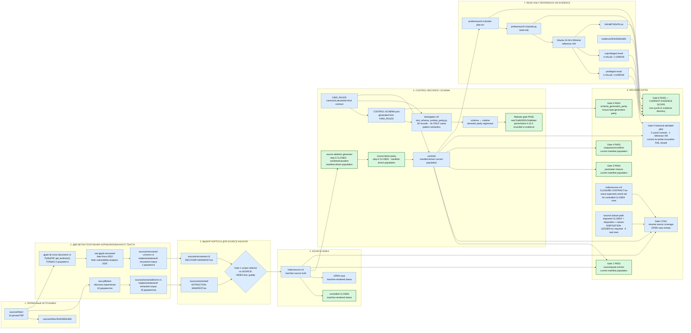
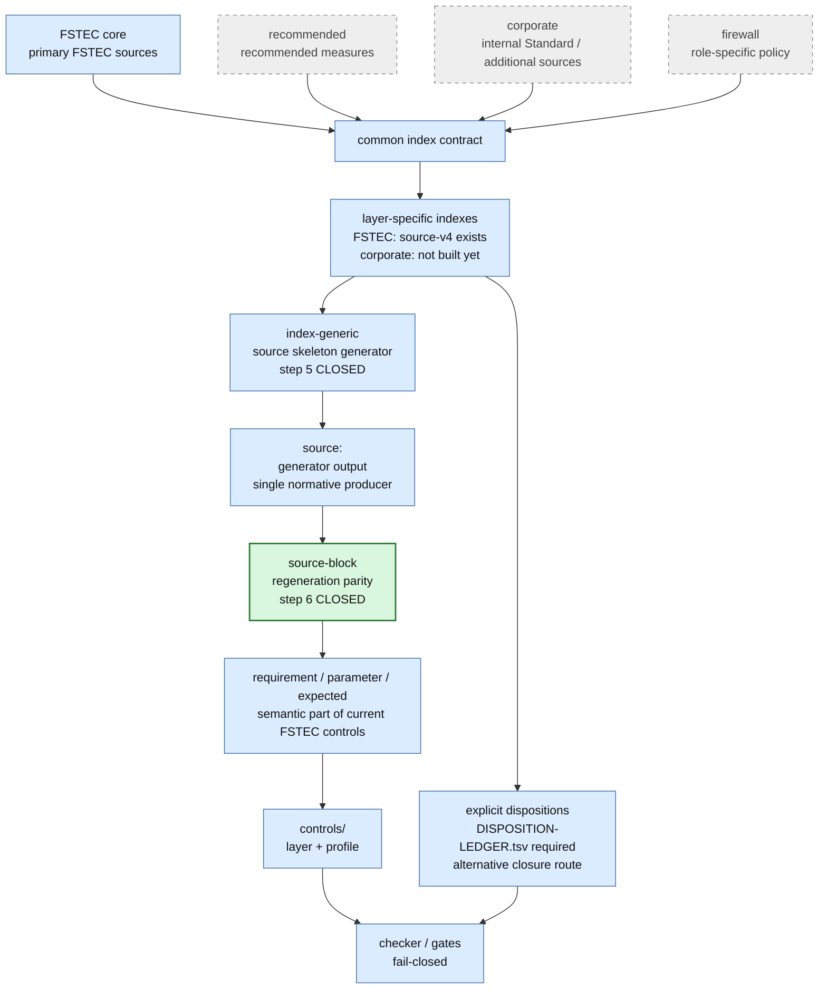
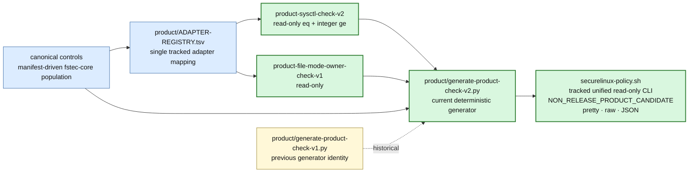
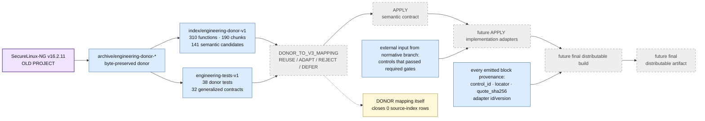
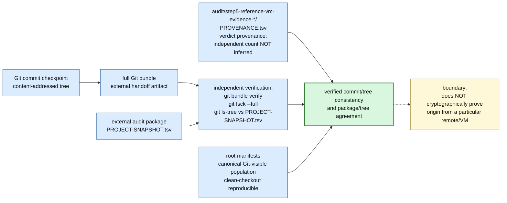

# SecureLinux-Policy v3 — карта проекта и взаимодействий

> **Это основная архитектурная карта текущего SecureLinux-Policy v3.**
>
> Карта показывает действующие источники истины, текстовые корпуса, source
> index, controls, механические gates, reference-VM evidence, audit provenance,
> policy layers, engineering donor, текущую read-only CHECK product-line и путь к будущему distributable artifact.
>
> Старый SecureLinux-NG присутствует только как **engineering donor**. Его
> runtime-архитектура не является нормативной архитектурой v3 и сама по себе
> не закрывает source-index rows.

<!-- BEGIN GENERATED MAP STATUS -->
`source rows=349 · controlled CLOSED=40 · OPEN=309 · canonical controls=51 · adapters=18 · target=ubuntu-24.04-x86_64`

Точные таблицы покрытия: [`docs/fstec-coverage.md`](fstec-coverage.md).
<!-- END GENERATED MAP STATUS -->

Продуктовые правила слоёв: [`docs/policy-layers.md`](policy-layers.md).
Machine-generated coverage: [`docs/fstec-coverage.md`](fstec-coverage.md).
Текущая target-совместимость: [`docs/compatibility.md`](compatibility.md).

## Легенда

- зелёный — PASS/CLOSED **в явно указанном текущем scope**;
- серый — будущий этап;
- синий — действующий структурный компонент;
- фиолетовый — engineering donor;
- оранжевый используется **только в разделе «Где мы находимся»** и ровно один
  раз обозначает текущее место работы.

## 1. Источники → текстовые корпуса → index → controls → Gates

### Что важно в первой схеме

`recovered-v1` не является продолжением обычного `extracted/norm-v1`.
Восстановление читает PDF отдельным glyph-based путём только для двух
документов, затем отдельно нормализуется в `recovered-v1/norm-v1`.

Gate 1 выбирает нужный корпус по `SOURCE-INDEX.text_quality`:
`recovered-glyph-map-v1` ведёт через `RECOVERY-MANIFEST.tsv`; обычные readable
rows — через `EXTRACTION-MANIFEST.tsv`.

Gate 0 и differential suite — разные доказательства. Gate 0 проверяет
байтовую воспроизводимость schema generation. Семантическое совпадение
runtime/schema проверяет отдельная differential matrix. Roadmap step 4 сделал
реальный `Draft202012Validator` обязательным для release/audit.

Gate 2 имеет два допустимых пути закрытия строки: control coverage с точным
`CLOSURE-CONTRACT.tsv` либо explicit disposition + reason, подтверждённый
ровно одной записью `DISPOSITION-LEDGER.tsv`. Реальных disposed-строк пока 0.

## 2. Слои политики и единый index-конвейер

## 3. Текущая read-only product-line CHECK

Эта product-line отделена от historical Step 7B.0. `ADAPTER-REGISTRY.tsv`
пинует semantic contract, adapter binding и implementation по SHA-256.
Tracked `securelinux-policy.sh` и sidecar входят в root manifests и обязаны
byte-exact совпадать со свежим generator-v2 output. `dist/` остаётся optional
gitignored rebuild output. APPLY mutation capability здесь отсутствует. Принятый
CHECK CLI сохраняет `--apply`/`--restore` как fail-closed `NOT_IMPLEMENTED` stubs;
`--restore` не является future feature.

## 4. Инженерный донор → будущий APPLY runtime

## 5. Provenance, Git checkpoint и воспроизводимость дерева

Git bundle — внешний артефакт для аудита и handoff, а не утверждение, что
репозиторий хранит каждый созданный bundle. Проверка bundle доказывает
внутреннюю согласованность commit/tree и позволяет независимо сравнить дерево,
но не доказывает, что commit был получен из конкретного remote.

## 6. Где мы находимся

Эта схема показывает **текущий product checkpoint внутри макроэтапа Step 7B**.
Она не повторяет историческую последовательность gates и не изображает уже
реализованные CHECK adapters/generator как будущую работу.

```mermaid
flowchart LR
    P1["CHECK-8 product-line<br/>read-only adapters + tracked generator<br/>DONE"]:::closed
    P2["TEST BASELINE<br/>DEV / RELEASE runner<br/>DONE"]:::closed
    P3["DOCUMENTATION BASELINE<br/>machine-parity docs<br/>DONE"]:::closed
    P4["SRC-0005 / 2.3.1<br/>3 canonical file-mode controls<br/>DONE"]:::closed
    P5["CHECK-11<br/>regenerate + read-only run<br/>DONE"]:::closed
    P6["sysctl exact-eq batch<br/>SRC-0030,0031,0036–0039 + CHECK-17<br/>DONE"]:::closed
    P7["SRC-0040 / 2.6.6<br/>terminal source-boundary fix + CHECK-18<br/>DONE"]:::closed
    P8["SRC-0033 / 2.5.10<br/>sysctl lower-bound ge 4096 + CHECK-19<br/>DONE"]:::closed
    P9["kernel-cmdline exact-token batch<br/>7 source rows · 9 controls + CHECK-28<br/>DONE"]:::closed
    P9A["SRC-0010 / 2.3.6<br/>system cron roots + direct files · 6 controls<br/>DONE"]:::closed
    P9B["UNIFIED CLI / QUICK START v1<br/>securelinux-policy.sh · pretty/raw/json<br/>DONE"]:::closed
    P10["fstec-linux-2022 CHECK COMPLETE<br/>tag fstec-linux-2022-check-complete-v1<br/>DONE"]:::closed
    P10A["МЫ ЗДЕСЬ<br/>DONOR_TO_V3_MAPPING<br/>precondition"]:::current
    P11["APPLY semantic contract<br/>future"]:::future
    P12["APPLY implementation<br/>future"]:::future
    P13["final distributable artifact<br/>future"]:::future
    SNAP["post-APPLY rollback<br/>EXTERNAL SNAPSHOT<br/>outside product"]:::note

    P1 --> P2 --> P3 --> P4 --> P5 --> P6 --> P7 --> P8 --> P9 --> P9A --> P9B --> P10 --> P10A --> P11 --> P12 --> P13
    P12 -. operational recovery boundary .-> SNAP

    classDef closed fill:#d9f7df,stroke:#2f7d32,color:#111,stroke-width:2px;
    classDef current fill:#ffe2a8,stroke:#c77800,color:#111,stroke-width:4px;
    classDef future fill:#eeeeee,stroke:#888,color:#444,stroke-dasharray: 5 5;
    classDef note fill:#fff8d8,stroke:#9d8730,color:#111;
```

`fstec-linux-2022` read-only CHECK vertical принят и закреплён tag
`fstec-linux-2022-check-complete-v1` на commit
`219b4cc3c0673c55575fb558e160431c11c2a681`. Project-wide source index при этом
по-прежнему содержит OPEN rows других документов, но следующий source-scoped
этап — не новый нормативный документ: сначала завершается `DONOR_TO_V3_MAPPING`,
затем отдельные APPLY semantic contract и implementation для уже принятого
`fstec-linux-2022`. Read-only CHECK bytes/controls/adapters при этом не меняются.
Unified read-only CLI не открывает будущий APPLY track; RESTORE исключён из
целевой архитектуры.

Операционная модель rollback после завершённого APPLY — внешний snapshot.
Транзакционно-локальный compensating rollback внутри незавершённого APPLY
остаётся допустимым failure-handling mechanism, но отдельного RESTORE mode нет.

## Что является источником истины

Финальный distributable artifact пока не реализован и его имя не закреплено
как current product contract. В будущем он должен получаться детерминированной
сборкой из проверенных нормативных controls, инженерных semantic contracts,
implementation adapters и tests.

Направление проекта:

`source → text corpus → index → control/disposition → gates → semantic contract → read-only adapter → generator v2 → tracked unified CHECK CLI → future APPLY`

а не:

`old shell script → manual edits → new shell script`.
