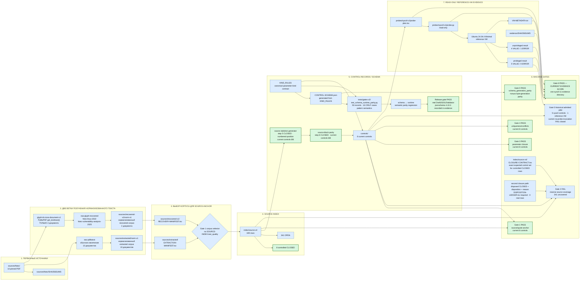
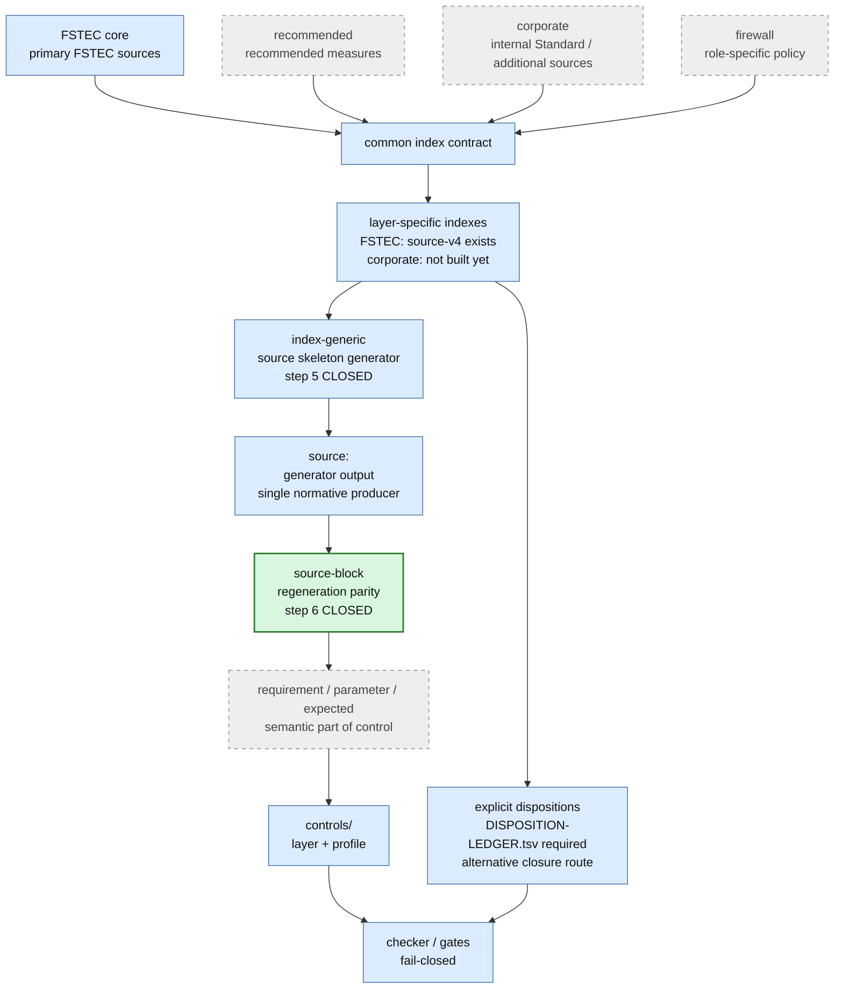
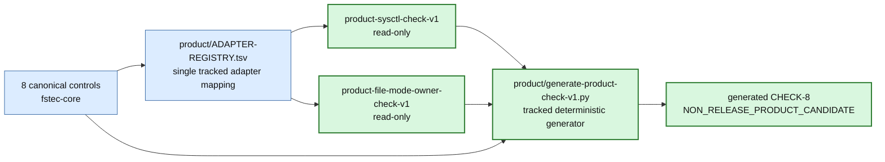
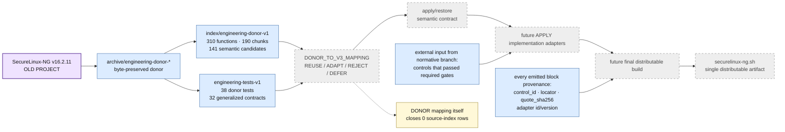
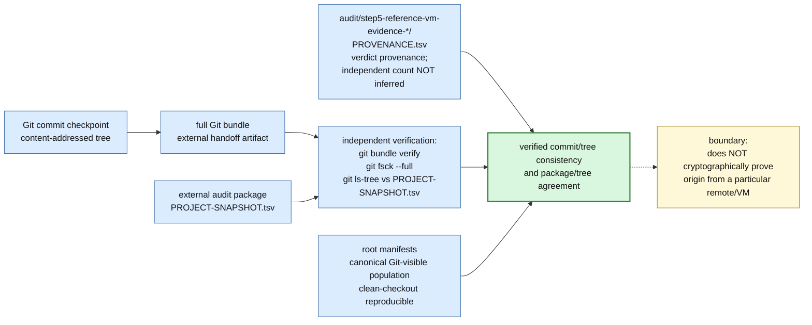

# SecureLinux-Policy v3 — карта проекта и взаимодействий

> **Это основная архитектурная карта текущего SecureLinux-Policy v3.**
>
> Карта показывает действующие источники истины, текстовые корпуса, source
> index, controls, механические gates, reference-VM evidence, audit provenance,
> policy layers, engineering donor и путь к конечному `securelinux-ng.sh`.
>
> Старый SecureLinux-NG присутствует только как **engineering donor**. Его
> runtime-архитектура не является нормативной архитектурой v3 и сама по себе
> не закрывает source-index rows.

## Легенда

- зелёный — PASS/CLOSED **в явно указанном текущем scope**;
- серый — будущий этап;
- синий — действующий структурный компонент;
- фиолетовый — engineering donor;
- оранжевый используется **только в разделе «Где мы находимся»** и ровно один
  раз обозначает текущее место работы.

## 1. Источники → текстовые корпуса → index → controls → Gates

### Что важно в первой схеме

`recovered-v1` не является продолжением обычного `extracted/norm-v1`.
Восстановление читает PDF отдельным glyph-based путём только для двух
документов, затем отдельно нормализуется в `recovered-v1/norm-v1`.

Gate 1 выбирает нужный корпус по `SOURCE-INDEX.text_quality`:
`recovered-glyph-map-v1` ведёт через `RECOVERY-MANIFEST.tsv`; обычные readable
rows — через `EXTRACTION-MANIFEST.tsv`.

Gate 0 и differential suite — разные доказательства. Gate 0 проверяет
байтовую воспроизводимость schema generation. Семантическое совпадение
runtime/schema проверяет отдельная differential matrix. Roadmap step 4 сделал
реальный `Draft202012Validator` обязательным для release/audit.

Gate 2 имеет два допустимых пути закрытия строки: control coverage с точным
`CLOSURE-CONTRACT.tsv` либо explicit disposition + reason, подтверждённый
ровно одной записью `DISPOSITION-LEDGER.tsv`. Реальных disposed-строк пока 0.

## 2. Слои политики и единый index-конвейер

## 3. Текущая read-only product-line CHECK

Эта product-line отделена от historical Step 7B.0. `ADAPTER-REGISTRY.tsv`
пинует semantic contract, adapter binding и implementation по SHA-256.
Generated `dist/` является derived output и не входит в root manifests.
APPLY/RESTORE здесь отсутствуют.

## 4. Инженерный донор → будущий APPLY/RESTORE runtime

## 5. Provenance, Git checkpoint и воспроизводимость дерева

Git bundle — внешний артефакт для аудита и handoff, а не утверждение, что
репозиторий хранит каждый созданный bundle. Проверка bundle доказывает
внутреннюю согласованность commit/tree и позволяет независимо сравнить дерево,
но не доказывает, что commit был получен из конкретного remote.

## 6. Где мы находимся

Текущий orange node обозначает macro-roadmap Step 7B, а не утверждает, что
внутри него не существует завершённых product checkpoints. На текущем HEAD
read-only product-line Steps 1–3 и CHECK-8 уже реализованы; APPLY/RESTORE
по-прежнему не открыты.

## Что является источником истины

Финальный `securelinux-ng.sh` не редактируется вручную. Он должен получаться
детерминированной сборкой из проверенных нормативных controls, инженерных
semantic contracts, implementation adapters и tests.

Направление проекта:

`source → text corpus → index → control/disposition → gates → semantic contract → adapter → deterministic build → script`

а не:

`old shell script → manual edits → new shell script`.
