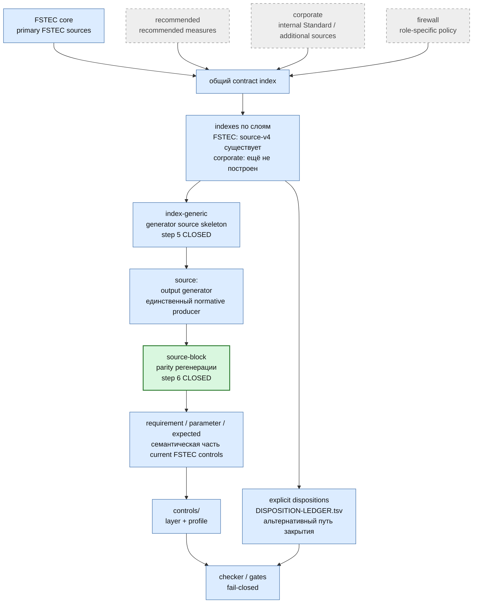
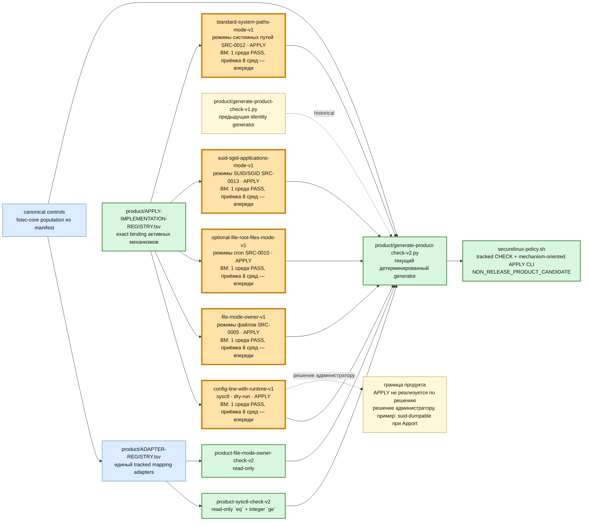
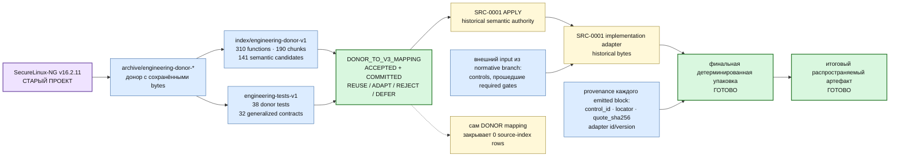
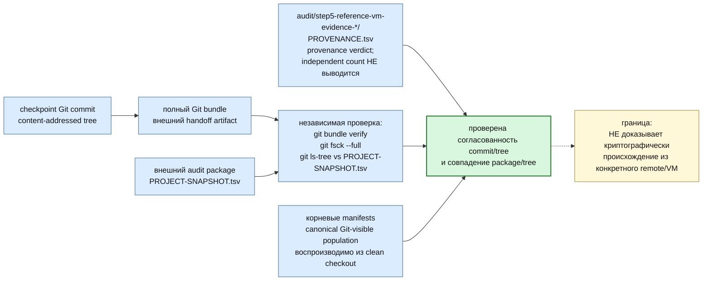

# SecureLinux-Policy — карта проекта и взаимодействий

> **Это основная архитектурная карта текущего SecureLinux-Policy.**
>
> Карта показывает действующие источники истины, текстовые корпуса, source
> index, controls, механические gates, reference-VM evidence, audit provenance,
> policy layers, engineering donor, текущую CHECK + mechanism-oriented APPLY product-line и путь к будущему distributable artifact.
>
> Старый SecureLinux-NG присутствует только как **engineering donor**. Его
> runtime-архитектура не является нормативной архитектурой SecureLinux-Policy и сама по себе
> не закрывает source-index rows.

<!-- BEGIN GENERATED MAP STATUS -->
`строки source=349 · controlled CLOSED=40 · OPEN=98 · canonical controls=51 · adapters=18 · target-family=linux-x86_64-supported-v1`

Точные таблицы покрытия: [`docs/fstec-coverage.md`](fstec-coverage.md).
<!-- END GENERATED MAP STATUS -->

Продуктовые правила слоёв: [`docs/policy-layers.md`](policy-layers.md).
Машинно сформированное coverage: [`docs/fstec-coverage.md`](fstec-coverage.md).
Текущая target-совместимость: [`docs/compatibility.md`](compatibility.md).

## Легенда

- зелёный — PASS/CLOSED **в явно указанном текущем scope**;
- серый — будущий этап;
- синий — действующий структурный компонент;
- фиолетовый — engineering donor;
- оранжевый используется **только в разделе «Где мы находимся»** и ровно один
  раз обозначает текущее место работы.

## 1. Источники → текстовые корпуса → index → controls → Gates

```mermaid
flowchart LR
    subgraph SRC["1. ПЕРВИЧНЫЕ ИСТОЧНИКИ"]
        PDF["sources/fstec/<br/>11 закреплённых PDF"]:::component
        PHASH["sources/fstec/SHA256SUMS"]:::component
        PDF --> PHASH
    end

    subgraph TEXT["2. ДВЕ ВЕТКИ ПОЛУЧЕНИЯ НОРМАЛИЗОВАННОГО ТЕКСТА"]
        RAWEXT["raw-pdftotext<br/>обычное извлечение<br/>10 документов"]:::component
        EXNORM["sources/extracted/norm-v1<br/>нормализованный extracted corpus<br/>10 документов"]:::component

        GLYPH["glyph-id-cross-document-v1<br/>PyMuPDF get_texttrace()<br/>ТОЛЬКО 2 документа"]:::component
        RAWREC["raw-glyph-recovered<br/>fstec-linux-2022<br/>fstec-vulnerability-analysis-2025"]:::component
        RECNORM["sources/recovered-v1/norm-v1<br/>нормализованный recovered corpus<br/>2 документа"]:::component

        PDF --> RAWEXT --> EXNORM
        PDF --> GLYPH --> RAWREC --> RECNORM
    end

    subgraph SELECT["3. ВЫБОР КОРПУСА ДЛЯ SOURCE ANCHOR"]
        QUALITY{"селектор корпуса Gate 1<br/>по SOURCE-INDEX.text_quality"}:::component
        EXMAN["sources/extracted/<br/>EXTRACTION-MANIFEST.tsv"]:::component
        RECMAN["sources/recovered-v1/<br/>RECOVERY-MANIFEST.tsv"]:::component

        EXNORM --> EXMAN --> QUALITY
        RECNORM --> RECMAN --> QUALITY
    end

    subgraph INDEX["4. ИНДЕКС ИСТОЧНИКОВ"]
        IDX["index/source-v4<br/>машинная source truth"]:::component
        CLOSED["controlled CLOSED<br/>статус из machine truth"]:::closed
        OPEN["строки OPEN<br/>статус из machine truth"]:::component
        QUALITY --> IDX
        IDX --> CLOSED
        IDX --> OPEN
    end

    subgraph CONTROL["5. CONTROL RECORDS / СХЕМА"]
        CTRL["controls/<br/>current population из manifest"]:::component
        KIND["KIND_RULES<br/>канонический contract parameter-kind"]:::component
        SCHEMA["CONTROL-SCHEMA.json<br/>сгенерировано из KIND_RULES"]:::component
        DIFF["tests/gates-v3/<br/>test_schema_runtime_parity.py<br/>50 records · 16 cases CR/LF<br/>семантика pattern"]:::component
        SEMPAR["schema ↔ runtime<br/>regression семантической parity"]:::component
        REALJSON["Release gate PASS<br/>реальный Draft202012Validator<br/>jsonschema 4.10.3 записан в evidence"]:::closed

        KIND --> SCHEMA
        KIND --> DIFF
        SCHEMA --> DIFF --> SEMPAR --> REALJSON
        IDX --> SGEN["generator source skeleton<br/>step 5 CLOSED · numbered-position<br/>population из manifest"]:::closed
        SGEN --> SPAR["parity source-block<br/>step 6 CLOSED · population из manifest"]:::closed
        SPAR --> CTRL
        KIND --> CTRL
    end

    subgraph GATES["6. МАШИННЫЕ GATES"]
        G0["Gate 0 PASS<br/>schema_generation_parity<br/>только byte-generation parity"]:::closed
        G1["Gate 1 PASS<br/>source/quote anchor<br/>current population manifest"]:::closed
        G2["Gate 2 FAIL<br/>обратное покрытие source<br/>остаются строки OPEN"]:::component
        G3["Gate 3 PASS<br/>закрытие parameters<br/>current population manifest"]:::closed
        G4["Gate 4 PASS<br/>уникальность/конфликты<br/>current population manifest"]:::closed
        G5["Gate 5 historical pilot с admission<br/>5 sysctl controls · 1 reference VM<br/>current запуск без probe — FAIL-closed"]:::component
        G6["Gate 6 PASS — CURRENT EVIDENCE SCOPE<br/>один каталог evidence sysctl-v1"]:::closed

        CLOSURE["index/source-v4/<br/>CLOSURE-CONTRACT.tsv<br/>точный ожидаемый набор controls<br/>для controlled CLOSED rows"]:::component
        DISP["второй путь закрытия:<br/>disposed CLOSED + disposition + reason<br/>запись в DISPOSITION-LEDGER.tsv"]:::component

        SCHEMA --> G0
        IDX --> G1
        CTRL --> G1

        IDX --> G2
        CTRL --> G2
        CLOSURE --> G2
        DISP --> G2

        CTRL --> G3
        CTRL --> G4
        CTRL --> G5
    end

    subgraph EVID["7. READ-ONLY EVIDENCE REFERENCE-VM"]
        PLAN["probes/sysctl-v1/probe-plan.tsv"]:::component
        PROBE["probes/sysctl-v1/probe.py<br/>read-only"]:::component
        VM["Ubuntu 24.04.4 Minimal<br/>reference VM"]:::component
        PRIV["результат privileged<br/>5 VALUE / 0 ERROR"]:::component
        UNPRIV["результат unprivileged<br/>4 VALUE / 1 ERROR"]:::component
        META["VM-METADATA.txt"]:::component
        SUMS["evidence/SHA256SUMS"]:::component

        CTRL --> PLAN --> PROBE --> VM
        VM --> PRIV
        VM --> UNPRIV
        VM --> META

        PRIV --> G5

        META --> G6
        PROBE --> G6
        PLAN --> G6
        PRIV --> G6
        UNPRIV --> G6
        SUMS --> G6
    end

    classDef closed fill:#d9f7df,stroke:#2f7d32,color:#111,stroke-width:2px;
    classDef component fill:#dcecff,stroke:#3e6ea8,color:#111;
    classDef future fill:#eeeeee,stroke:#888,color:#444,stroke-dasharray: 5 5;
```

### Что важно в первой схеме

`recovered-v1` не является продолжением обычного `extracted/norm-v1`.
Восстановление читает PDF отдельным glyph-based путём только для двух
документов, затем отдельно нормализуется в `recovered-v1/norm-v1`.

Одиннадцатый закреплённый PDF — `fstec-order-137-2026-amendments-to-117.pdf` —
image-only authority. Он не включается в обычную `pdftotext`/glyph-recovery
population. Его exact PDF остаётся каноническим источником, page-pinned
визуальная транскрипция хранится в `sources/visual-v1/`, а связь
`fstec-order-117-2025-requirements` → amendment № 137 фиксируется отдельно в
`index/source-v4/FRAMEWORK-AUTHORITY-RELATIONS.tsv`. Эта framework authority
сама по себе не создаёт новые строки `SRC-*` и не переоткрывает
`SRC-0001…SRC-0040`.

Gate 1 выбирает нужный корпус по `SOURCE-INDEX.text_quality`:
`recovered-glyph-map-v1` ведёт через `RECOVERY-MANIFEST.tsv`; обычные readable
rows — через `EXTRACTION-MANIFEST.tsv`.

Gate 0 и differential suite — разные доказательства. Gate 0 проверяет
байтовую воспроизводимость schema generation. Семантическое совпадение
runtime/schema проверяет отдельная differential matrix. Roadmap step 4 сделал
реальный `Draft202012Validator` обязательным для release/audit.

Gate 2 имеет два допустимых пути закрытия строки: control coverage с точным
`CLOSURE-CONTRACT.tsv` либо explicit disposition + reason, подтверждённый
ровно одной записью `DISPOSITION-LEDGER.tsv`. Число закрытых диспозицией строк
показывает генерируемый машинный статус.

## 2. Слои политики и единый index-конвейер

## 3. Текущая product-line: read-only CHECK + mechanism-oriented APPLY

Эта product-line отделена от historical Step 7B.0. `ADAPTER-REGISTRY.tsv`
пинует semantic contract, adapter binding и implementation по SHA-256.
Tracked `securelinux-policy.sh` и sidecar входят в root manifests и обязаны
byte-exact совпадать со свежим generator-v2 output. `dist/` остаётся optional
gitignored rebuild output. APPLY scope вычисляется из `apply.supported=true` controls и
маршрутизируется через `APPLY-KIND-REGISTRY.tsv` в механизмы `config-line-with-runtime-v1`
(sysctl), `file-mode-owner-v1` (режимы файлов), `optional-file-root-files-mode-v1`
(режимы системных файлов cron), `suid-sgid-applications-mode-v1`
(режимы SUID/SGID-приложений) и `standard-system-paths-mode-v1`
(режимы стандартных системных путей). SRC-0001 выведен из product APPLY, его артефакты historical.
Пользовательский `--restore` отсутствует, потому что operational RESTORE не является future feature.
Human-readable CHECK/REPORT выводит обнаруженную ОС, архитектуру, profile и runtime platform; target family един для всей поддерживаемой матрицы.

Статус узла механизма задаётся гейтами: `closed` — механизм прошёл `--release` и восьмисредовый VM-цикл;
`current` — идёт работа. Иного статуса у узла механизма нет.
Все пять механизмов в статусе `current`: на ВМ у каждого пройдена одна среда; приёмка восьми сред впереди.

Узел `ADMIN` — граница продукта: для части контролей APPLY не реализуется по решению,
и продукт возвращает решение администратору отдельным терминальным исходом.
Прецедент — `suid-dumpable` при обнаруженном Apport (`ABORTED_PRECONDITION_CONFLICT`).

## 4. Инженерный донор → принятый mapping → historical SRC-0001 APPLY → упаковка

## 5. Provenance, Git checkpoint и воспроизводимость дерева

Git bundle — внешний артефакт для аудита и handoff, а не утверждение, что
репозиторий хранит каждый созданный bundle. Проверка bundle доказывает
внутреннюю согласованность commit/tree и позволяет независимо сравнить дерево,
но не доказывает, что commit был получен из конкретного remote.

## 6. Где мы находимся

Историческая SRC-0001 APPLY-вертикаль (P13–P18) остаётся закрытой как доказанная
история, но решением DP-3 больше не является active product APPLY. Текущая authority
APPLY — общая форма `MECHANISM_AUTHORITY_V1`, по одному документу на механизм:
`config-line-with-runtime-v1` (sysctl), `file-mode-owner-v1`
(режимы файлов SRC-0005), `optional-file-root-files-mode-v1` (режимы cron SRC-0010),
`suid-sgid-applications-mode-v1` (режимы SUID/SGID-приложений SRC-0013) и
`standard-system-paths-mode-v1` (стандартные системные пути SRC-0012); контроли включаются через `apply.supported=true`,
а общий цикл выполняет generated CLI.
Старые SRC-0001 contracts/definitions/adapter сохраняются побайтово как historical.
`SINGLE_DISTRIBUTABLE_ARTIFACT` остаётся generated `securelinux-policy.sh`; полная
приёмка новой интеграции и восьмисредовый VM-cycle являются следующими gates.
`NEXT` machine roadmap — горизонт 1 `HORIZON1_SAFE_CLASS_APPLY_AND_VM_RUNS`:
APPLY для безопасных классов `fstec-linux-2022` и VM-прогоны механизмов. Step 7B
`FSTEC_AND_CORPORATE_INDEX_EXPANSION_DISPOSITIONS` ждёт закрытия горизонта 1.

```mermaid
flowchart LR
    P1["CHECK-8 product-line<br/>read-only adapters + tracked generator<br/>ГОТОВО"]:::closed
    P2["БАЗОВЫЙ НАБОР ТЕСТОВ<br/>DEV / RELEASE runner<br/>ГОТОВО"]:::closed
    P3["БАЗОВАЯ ДОКУМЕНТАЦИЯ<br/>docs с machine parity<br/>ГОТОВО"]:::closed
    P4["SRC-0005 / 2.3.1<br/>3 canonical file-mode controls<br/>ГОТОВО"]:::closed
    P5["CHECK-11<br/>регенерация + read-only запуск<br/>ГОТОВО"]:::closed
    P6["batch sysctl exact-eq<br/>SRC-0030,0031,0036–0039 + CHECK-17<br/>ГОТОВО"]:::closed
    P7["SRC-0040 / 2.6.6<br/>исправление terminal source-boundary + CHECK-18<br/>ГОТОВО"]:::closed
    P8["SRC-0033 / 2.5.10<br/>sysctl lower-bound `ge 4096` + CHECK-19<br/>ГОТОВО"]:::closed
    P9["batch kernel-cmdline exact-token<br/>7 source rows · 9 controls + CHECK-28<br/>ГОТОВО"]:::closed
    P9A["SRC-0010 / 2.3.6<br/>system cron roots + direct files · 6 controls<br/>ГОТОВО"]:::closed
    P9B["ЕДИНЫЙ CLI / БЫСТРЫЙ СТАРТ v1<br/>securelinux-policy.sh · pretty/raw/json<br/>ГОТОВО"]:::closed
    P10["fstec-linux-2022 CHECK COMPLETE<br/>tag fstec-linux-2022-check-complete-v1<br/>ГОТОВО"]:::closed
    P10A["DONOR_TO_V3_MAPPING<br/>ACCEPTED + COMMITTED<br/>1db91b0…<br/>ГОТОВО"]:::closed
    P11["APPLY parent gate<br/>ПРИНЯТО<br/>SRC-0001 flat contract candidate: REVISE"]:::note
    P12["AUTHORITY_2026_REFRESH<br/>приказы № 117 + № 137<br/>ГОТОВО"]:::closed
    P13["SRC-0001 modular APPLY contract architecture<br/>compact registry + SHA bindings<br/>ГОТОВО"]:::closed
    P14["SRC-0001 predicate / transform definitions<br/>exact empty + exact bang<br/>ГОТОВО"]:::closed
    P15["SRC-0001 external snapshot precondition<br/>exact attestation + prestate binding<br/>ГОТОВО"]:::closed
    P16["SRC-0001 lock/reread + object identity<br/>stale + path identity fail-closed<br/>ГОТОВО"]:::closed
    P17["SRC-0001 метаданные/транзакция/отчёт<br/>8 определений + композиция<br/>ГОТОВО"]:::closed
    P18["APPLY для SRC-0001<br/>ОДНА ВЕРТИКАЛЬ<br/>ГОТОВО"]:::closed
    P19["финальная детерминированная упаковка<br/>ГОТОВО"]:::closed
    P20["единый распространяемый артефакт<br/>ГОТОВО"]:::closed
    P21["МЫ ЗДЕСЬ<br/>горизонт 1 · APPLY безопасных классов + ВМ"]:::current
    P22["Step 7B · расширение FSTEC<br/>ждёт закрытия горизонта 1"]:::future
    SNAP["восстановление после APPLY<br/>ВНЕШНИЙ СНИМОК<br/>вне продукта"]:::note

    P1 --> P2 --> P3 --> P4 --> P5 --> P6 --> P7 --> P8 --> P9 --> P9A --> P9B --> P10 --> P10A --> P11 --> P12 --> P13 --> P14 --> P15 --> P16 --> P17 --> P18 --> P19 --> P20 --> P21 --> P22
    P18 -. граница operational recovery .-> SNAP

    classDef closed fill:#d9f7df,stroke:#2f7d32,color:#111,stroke-width:2px;
    classDef current fill:#ffe2a8,stroke:#c77800,color:#111,stroke-width:4px;
    classDef future fill:#eeeeee,stroke:#888,color:#444,stroke-dasharray: 5 5;
    classDef note fill:#fff8d8,stroke:#9d8730,color:#111;
```

`fstec-linux-2022` read-only CHECK vertical и donor mapping остаются принятыми.
Модульная SRC-0001 architecture связывает exact SHA восьми historical definition roles и сохраняется как evidence прошлой вертикали. В active APPLY registries её больше нет. Текущий generated CLI маршрутизирует APPLY через пять механизмов: `config-line-with-runtime-v1`, `file-mode-owner-v1`, `optional-file-root-files-mode-v1`, `suid-sgid-applications-mode-v1` и `standard-system-paths-mode-v1`. ВМ-PASS механизма `standard-system-paths-mode-v1` (20.09.2026) выполнен повторно на кандидате `ba96131b…a55b` после исправления обхода подкаталогов; прежний PASS относится к кандидату `e170aae1…dd38`. Текущий кандидат `be828dae…5128` (CHECK: недоступность не принимается за отсутствие; `pam-wheel-access` разбирает проверенные байты за одно чтение; dispatcher проверяет каталог состояния и берёт `flock`) отличается от обоих; ВМ-прогон на нём не выполнен. Operational recovery после завершённого
APPLY остаётся внешним snapshot/backup, а пользовательский RESTORE исключён.

## Что является источником истины

Framework authority для текущего 2026 refresh задаётся
`index/source-v4/FRAMEWORK-SOURCES.tsv` и
`index/source-v4/FRAMEWORK-AUTHORITY-RELATIONS.tsv`; exact image-only bytes
приказа № 137 пинуются `sources/fstec/SHA256SUMS`, а derived page-pinned
представление — `sources/visual-v1/PROVENANCE.tsv`.

Текущий single distributable artifact этой вертикали — generated
`securelinux-policy.sh`; он получается детерминированной сборкой из проверенных
normative controls, semantic contracts и implementation adapters. Sidecar
используется как сопутствующее integrity metadata и не образует отдельный
архивный слой.

Имя будущего release/distributable остаётся не закреплено.

Направление проекта:

`source → text corpus → index → control/disposition → gates → semantic contract → CHECK/APPLY adapters → generator v2 → tracked unified CLI → final packaging`

а не:

`old shell script → manual edits → new shell script`.

## Карта сегментации контролей fstec-linux-2022

Карта принята 19.09.2026 и служит для планирования APPLY. Классы построены по
фактам байтов контролей и CHECK-контрактов: вид цели, стабильность популяции и
направление мутации. Каждый контроль входит ровно в один класс; полноту и
совпадение колонки «APPLY сейчас» с `apply.supported` проверяет
`tests/roadmap-v1/test_project_map.py`.

| класс | определение | control_id | APPLY сейчас |
|---|---|---|---|
| G1 | sysctl: runtime и persistent-значение параметра ядра | `FSTEC-LINUX-2022-2.4.1-DMESG-RESTRICT`, `FSTEC-LINUX-2022-2.4.2-KPTR-RESTRICT`, `FSTEC-LINUX-2022-2.4.8-BPF-JIT-HARDEN`, `FSTEC-LINUX-2022-2.5.2-PERF-EVENT-PARANOID`, `FSTEC-LINUX-2022-2.5.4-KEXEC-LOAD-DISABLED`, `FSTEC-LINUX-2022-2.5.5-MAX-USER-NAMESPACES`, `FSTEC-LINUX-2022-2.5.6-UNPRIVILEGED-BPF-DISABLED`, `FSTEC-LINUX-2022-2.5.7-UNPRIVILEGED-USERFAULTFD`, `FSTEC-LINUX-2022-2.5.8-LDISC-AUTOLOAD`, `FSTEC-LINUX-2022-2.5.10-MMAP-MIN-ADDR`, `FSTEC-LINUX-2022-2.5.11-RANDOMIZE-VA-SPACE`, `FSTEC-LINUX-2022-2.6.1-PTRACE-SCOPE`, `FSTEC-LINUX-2022-2.6.2-PROTECTED-SYMLINKS`, `FSTEC-LINUX-2022-2.6.3-PROTECTED-HARDLINKS`, `FSTEC-LINUX-2022-2.6.4-PROTECTED-FIFOS`, `FSTEC-LINUX-2022-2.6.5-PROTECTED-REGULAR`, `FSTEC-LINUX-2022-2.6.6-SUID-DUMPABLE` | да |
| G2 | режим файла по фиксированному пути, только снятие битов | `FSTEC-LINUX-2022-2.3.1-GROUP-MODE`, `FSTEC-LINUX-2022-2.3.1-PASSWD-MODE`, `FSTEC-LINUX-2022-2.3.1-SHADOW-GO-RWX` | да |
| G3 | режимы и владелец файлов по нестабильной популяции: пользователи, процессы, настроенные команды | `FSTEC-LINUX-2022-2.3.2-RUNNING-PROCESS-PATHS-WRITE-PROTECTION`, `FSTEC-LINUX-2022-2.3.3-CRON-COMMAND-PATHS-WRITE-PROTECTION`, `FSTEC-LINUX-2022-2.3.4-SUDO-ROOT-COMMAND-FILES-PROTECTION`, `FSTEC-LINUX-2022-2.3.7-USER-CRON-FILES-MODE`, `FSTEC-LINUX-2022-2.3.10-HOME-SENSITIVE-FILES-MODE`, `FSTEC-LINUX-2022-2.3.11-HOME-DIRECTORIES-MODE` | нет |
| G4 | параметры ядра в командной строке загрузки: правка загрузчика и перезагрузка | `FSTEC-LINUX-2022-2.4.3-INIT-ON-ALLOC`, `FSTEC-LINUX-2022-2.4.4-SLAB-NOMERGE`, `FSTEC-LINUX-2022-2.4.5-IOMMU-FORCE`, `FSTEC-LINUX-2022-2.4.5-IOMMU-STRICT`, `FSTEC-LINUX-2022-2.4.5-IOMMU-PASSTHROUGH`, `FSTEC-LINUX-2022-2.4.6-RANDOMIZE-KSTACK-OFFSET`, `FSTEC-LINUX-2022-2.4.7-MITIGATIONS`, `FSTEC-LINUX-2022-2.5.1-VSYSCALL`, `FSTEC-LINUX-2022-2.5.3-DEBUGFS`, `FSTEC-LINUX-2022-2.5.9-TSX` | нет |
| G5 | политика или allowlist, которые определяет администратор | `FSTEC-LINUX-2022-2.2.1-SU-WHEEL-ACCESS`, `FSTEC-LINUX-2022-2.2.2-SUDOERS-REVIEWED-POLICY`, `FSTEC-LINUX-2022-2.3.9-SUID-SGID-ALLOWLIST`, `FSTEC-LINUX-2022-2.5.11-RANDOMIZE-VA-SPACE-TESTED-BEFORE-USE` | нет |
| G6 | режимы файлов по вычисляемой стабильной популяции системных объектов (корни cron, файлы запуска, стандартные системные пути, SUID/SGID-файлы непсевдо-точек монтирования), только снятие битов | `FSTEC-LINUX-2022-2.3.6-CRONTAB`, `FSTEC-LINUX-2022-2.3.6-CRON-D`, `FSTEC-LINUX-2022-2.3.6-CRON-HOURLY`, `FSTEC-LINUX-2022-2.3.6-CRON-DAILY`, `FSTEC-LINUX-2022-2.3.6-CRON-WEEKLY`, `FSTEC-LINUX-2022-2.3.6-CRON-MONTHLY`, `FSTEC-LINUX-2022-2.3.9-SUID-SGID-MODE`, `FSTEC-LINUX-2022-2.3.8-STANDARD-SYSTEM-PATHS-MODE` | да |
| G6 | режимы файлов по вычисляемой стабильной популяции системных объектов (корни cron, файлы запуска, стандартные системные пути, SUID/SGID-файлы непсевдо-точек монтирования), только снятие битов | `FSTEC-LINUX-2022-2.3.5-STARTUP-FILES-WRITE-PROTECTION` | нет |
| G7 | содержимое конфигурационных файлов | `FSTEC-LINUX-2022-2.1.1-LOCAL-ACCOUNT-PASSWORD-STATE`, `FSTEC-LINUX-2022-2.1.2-SSH-ROOT-LOGIN` | нет |

Для `suid-dumpable` при обнаруженном Apport APPLY возвращает решение
администратору. У `SRC-0008` в G3 мутация включает условную смену владельца;
его APPLY отложен до отработки шаблона механизма. APPLY для `SRC-0001` выведен
из продукта решением DP-3.

## Отложено сознательно

Эти направления не входят в горизонт 1; причина указана для каждого.

- APPLY для `SRC-0008` и пакет v7 — до отработки шаблона механизма APPLY.
- APPLY для kernel cmdline — цена ошибки: незагружающаяся система.
- Классы G3 и G5 — APPLY, вероятно, не появится: нестабильная популяция и неавтоматизируемость по классу.
- Генерируемый инвентарь механизмов в блоке карты — решением пользователя 19.09.2026 не делается сейчас; до него механизмы называются в ручной прозе без чисел.
