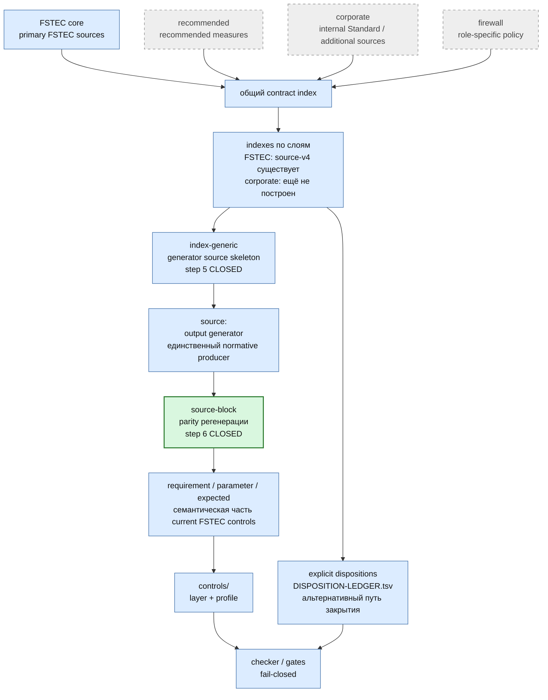
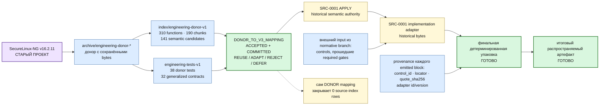
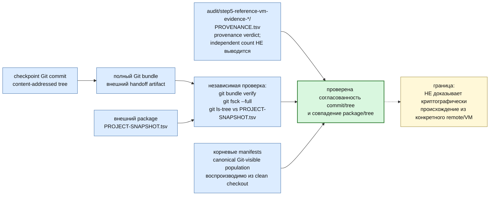

# SecureLinux-Policy — карта проекта и взаимодействий

> **Это основная архитектурная карта текущего SecureLinux-Policy.**
>
> Карта показывает действующие источники истины, текстовые корпуса, source
> index, controls, механические gates, reference-VM evidence, provenance,
> policy layers, engineering donor, текущую CHECK + mechanism-oriented APPLY product-line и путь к будущему distributable artifact.
>
> Старый SecureLinux-NG присутствует только как **engineering donor**. Его
> runtime-архитектура не является нормативной архитектурой SecureLinux-Policy и сама по себе
> не закрывает source-index rows.

<!-- BEGIN GENERATED MAP STATUS -->
`строки source=349 · controlled CLOSED=54 · OPEN=0 · canonical controls=83 · adapters=28 · target-family=linux-x86_64-supported-v1`

Точные таблицы покрытия: [`docs/fstec-coverage.md`](fstec-coverage.md).
<!-- END GENERATED MAP STATUS -->

Продуктовые правила слоёв: [`docs/policy-layers.md`](policy-layers.md).
Машинно сформированное coverage: [`docs/fstec-coverage.md`](fstec-coverage.md).
Текущая target-совместимость: [`docs/compatibility.md`](compatibility.md).

## Легенда

- зелёный — PASS/CLOSED **в явно указанном текущем scope**;
- серый — будущий этап;
- синий — действующий структурный компонент;
- фиолетовый — engineering donor;
- оранжевый используется **только в разделе «Где мы находимся»** и ровно один
  раз обозначает текущее место работы.

## 1. Источники → текстовые корпуса → index → controls → Gates

```mermaid
flowchart LR
    subgraph SRC["1. ПЕРВИЧНЫЕ ИСТОЧНИКИ"]
        PDF["sources/fstec/<br/>11 закреплённых PDF"]:::component
        PHASH["sources/fstec/SHA256SUMS"]:::component
        PDF --> PHASH
    end

    subgraph TEXT["2. ДВЕ ВЕТКИ ПОЛУЧЕНИЯ НОРМАЛИЗОВАННОГО ТЕКСТА"]
        RAWEXT["raw-pdftotext<br/>обычное извлечение<br/>10 документов"]:::component
        EXNORM["sources/extracted/norm-v1<br/>нормализованный extracted corpus<br/>10 документов"]:::component

        GLYPH["glyph-id-cross-document-v1<br/>PyMuPDF get_texttrace()<br/>ТОЛЬКО 2 документа"]:::component
        RAWREC["raw-glyph-recovered<br/>fstec-linux-2022<br/>fstec-vulnerability-analysis-2025"]:::component
        RECNORM["sources/recovered-v1/norm-v1<br/>нормализованный recovered corpus<br/>2 документа"]:::component

        PDF --> RAWEXT --> EXNORM
        PDF --> GLYPH --> RAWREC --> RECNORM
    end

    subgraph SELECT["3. ВЫБОР КОРПУСА ДЛЯ SOURCE ANCHOR"]
        QUALITY{"селектор корпуса Gate 1<br/>по SOURCE-INDEX.text_quality"}:::component
        EXMAN["sources/extracted/<br/>EXTRACTION-MANIFEST.tsv"]:::component
        RECMAN["sources/recovered-v1/<br/>RECOVERY-MANIFEST.tsv"]:::component

        EXNORM --> EXMAN --> QUALITY
        RECNORM --> RECMAN --> QUALITY
    end

    subgraph INDEX["4. ИНДЕКС ИСТОЧНИКОВ"]
        IDX["index/source-v4<br/>машинная source truth"]:::component
        CLOSED["controlled CLOSED<br/>статус из machine truth"]:::closed
        OPEN["строки OPEN<br/>статус из machine truth"]:::component
        QUALITY --> IDX
        IDX --> CLOSED
        IDX --> OPEN
    end

    subgraph CONTROL["5. CONTROL RECORDS / СХЕМА"]
        CTRL["controls/<br/>current population из manifest"]:::component
        KIND["KIND_RULES<br/>канонический contract parameter-kind"]:::component
        SCHEMA["CONTROL-SCHEMA.json<br/>сгенерировано из KIND_RULES"]:::component
        DIFF["tests/gates-v3/<br/>test_schema_runtime_parity.py<br/>50 records · 16 cases CR/LF<br/>семантика pattern"]:::component
        SEMPAR["schema ↔ runtime<br/>regression семантической parity"]:::component
        REALJSON["Release gate PASS<br/>реальный Draft202012Validator<br/>jsonschema 4.10.3 записан в evidence"]:::closed

        KIND --> SCHEMA
        KIND --> DIFF
        SCHEMA --> DIFF --> SEMPAR --> REALJSON
        IDX --> SGEN["generator source skeleton<br/>step 5 CLOSED · numbered-position<br/>population из manifest"]:::closed
        SGEN --> SPAR["parity source-block<br/>step 6 CLOSED · population из manifest"]:::closed
        SPAR --> CTRL
        KIND --> CTRL
    end

    subgraph GATES["6. МАШИННЫЕ GATES"]
        G0["Gate 0 PASS<br/>schema_generation_parity<br/>только byte-generation parity"]:::closed
        G1["Gate 1 PASS<br/>source/quote anchor<br/>current population manifest"]:::closed
        G2["Gate 2 FAIL<br/>обратное покрытие source<br/>остаются строки OPEN"]:::component
        G3["Gate 3 PASS<br/>закрытие parameters<br/>current population manifest"]:::closed
        G4["Gate 4 PASS<br/>уникальность/конфликты<br/>current population manifest"]:::closed
        G5["Gate 5 historical pilot с admission<br/>5 sysctl controls · 1 reference VM<br/>current запуск без probe — FAIL-closed"]:::component
        G6["Gate 6 PASS — CURRENT EVIDENCE SCOPE<br/>один каталог evidence sysctl-v1"]:::closed

        CLOSURE["index/source-v4/<br/>CLOSURE-CONTRACT.tsv<br/>точный ожидаемый набор controls<br/>для controlled CLOSED rows"]:::component
        DISP["второй путь закрытия:<br/>disposed CLOSED + disposition + reason<br/>запись в DISPOSITION-LEDGER.tsv"]:::component

        SCHEMA --> G0
        IDX --> G1
        CTRL --> G1

        IDX --> G2
        CTRL --> G2
        CLOSURE --> G2
        DISP --> G2

        CTRL --> G3
        CTRL --> G4
        CTRL --> G5
    end

    subgraph EVID["7. READ-ONLY EVIDENCE REFERENCE-VM"]
        PLAN["probes/sysctl-v1/probe-plan.tsv"]:::component
        PROBE["probes/sysctl-v1/probe.py<br/>read-only"]:::component
        VM["Ubuntu 24.04.4 Minimal<br/>reference VM"]:::component
        PRIV["результат privileged<br/>5 VALUE / 0 ERROR"]:::component
        UNPRIV["результат unprivileged<br/>4 VALUE / 1 ERROR"]:::component
        META["VM-METADATA.txt"]:::component
        SUMS["evidence/SHA256SUMS"]:::component

        CTRL --> PLAN --> PROBE --> VM
        VM --> PRIV
        VM --> UNPRIV
        VM --> META

        PRIV --> G5

        META --> G6
        PROBE --> G6
        PLAN --> G6
        PRIV --> G6
        UNPRIV --> G6
        SUMS --> G6
    end

    classDef closed fill:#d9f7df,stroke:#2f7d32,color:#111,stroke-width:2px;
    classDef component fill:#dcecff,stroke:#3e6ea8,color:#111;
    classDef future fill:#eeeeee,stroke:#888,color:#444,stroke-dasharray: 5 5;
```

### Что важно в первой схеме

`recovered-v1` не является продолжением обычного `extracted/norm-v1`.
Восстановление читает PDF отдельным glyph-based путём только для двух
документов, затем отдельно нормализуется в `recovered-v1/norm-v1`.

Одиннадцатый закреплённый PDF — `fstec-order-137-2026-amendments-to-117.pdf` —
image-only authority. Он не включается в обычную `pdftotext`/glyph-recovery
population. Его exact PDF остаётся каноническим источником, page-pinned
визуальная транскрипция хранится в `sources/visual-v1/`, а связь
`fstec-order-117-2025-requirements` → amendment № 137 фиксируется отдельно в
`index/source-v4/FRAMEWORK-AUTHORITY-RELATIONS.tsv`. Эта framework authority
сама по себе не создаёт новые строки `SRC-*` и не переоткрывает
`SRC-0001…SRC-0040`.

Gate 1 выбирает нужный корпус по `SOURCE-INDEX.text_quality`:
`recovered-glyph-map-v1` ведёт через `RECOVERY-MANIFEST.tsv`; обычные readable
rows — через `EXTRACTION-MANIFEST.tsv`.

Gate 0 и differential suite — разные доказательства. Gate 0 проверяет
байтовую воспроизводимость schema generation. Семантическое совпадение
runtime/schema проверяет отдельная differential matrix. Roadmap step 4 сделал
реальный `Draft202012Validator` обязательным для release.

Gate 2 имеет два допустимых пути закрытия строки: control coverage с точным
`CLOSURE-CONTRACT.tsv` либо explicit disposition + reason, подтверждённый
ровно одной записью `DISPOSITION-LEDGER.tsv`. Число закрытых диспозицией строк
показывает генерируемый машинный статус.

## 2. Слои политики и единый index-конвейер

```mermaid
flowchart TB
    FSTEC["FSTEC core<br/>primary FSTEC sources"]:::component
    RECOMMENDED["recommended<br/>recommended measures"]:::future
    CORPORATE["corporate<br/>internal Standard / additional sources"]:::future
    FIREWALL["firewall<br/>role-specific policy"]:::future

    FSTEC --> CONTRACT["общий contract index"]:::component
    RECOMMENDED --> CONTRACT
    CORPORATE --> CONTRACT
    FIREWALL --> CONTRACT

    CONTRACT --> INDEXES["indexes по слоям<br/>FSTEC: source-v4 существует<br/>corporate: ещё не построен"]:::component
    INDEXES --> GENERATOR["index-generic<br/>generator source skeleton<br/>step 5 CLOSED"]:::component
    GENERATOR --> SOURCE["source:<br/>output generator<br/>единственный normative producer"]:::component
    SOURCE --> PARITY["source-block<br/>parity регенерации<br/>step 6 CLOSED"]:::closed
    PARITY --> SEM["requirement / parameter / expected<br/>семантическая часть current FSTEC controls"]:::component
    SEM --> CONTROLS["controls/<br/>layer + profile"]:::component
    CONTROLS --> CHECKER["checker / gates<br/>fail-closed"]:::component

    DISP2["explicit dispositions<br/>DISPOSITION-LEDGER.tsv<br/>альтернативный путь закрытия"]:::component
    INDEXES --> DISP2
    DISP2 --> CHECKER

    classDef closed fill:#d9f7df,stroke:#2f7d32,color:#111,stroke-width:2px;
    classDef component fill:#dcecff,stroke:#3e6ea8,color:#111;
    classDef future fill:#eeeeee,stroke:#888,color:#444,stroke-dasharray: 5 5;
```

## 3. Текущая product-line: read-only CHECK + mechanism-oriented APPLY

```mermaid
flowchart LR
    CTRLNOW["canonical controls<br/>fstec-core population из manifest"]:::component
    REG["product/ADAPTER-REGISTRY.tsv<br/>единый tracked mapping adapters"]:::component
    SYS["product-sysctl-check-v2<br/>read-only `eq` + integer `ge`"]:::closed
    FILE["product-file-mode-owner-check-v2<br/>read-only"]:::closed
    GEN1["product/generate-product-check-v1.py<br/>предыдущая identity generator"]:::note
    GEN2["product/generate-product-check-v2.py<br/>текущий детерминированный generator"]:::closed
    IMPLREG["product/APPLY-IMPLEMENTATION-REGISTRY.tsv<br/>exact binding активных механизмов"]:::closed
    APPLY1["config-line-with-runtime-v1<br/>sysctl · dry-run · APPLY<br/>ВМ: приёмка семи сред 25.09.2026"]:::closed
    APPLY2["file-mode-owner-v1<br/>режимы файлов SRC-0005 · APPLY<br/>ВМ: приёмка семи сред 25.09.2026"]:::closed
    APPLY3["optional-file-root-files-mode-v1<br/>режимы cron SRC-0010 · APPLY<br/>ВМ: приёмка семи сред 25.09.2026"]:::closed
    APPLY4["suid-sgid-applications-mode-v1<br/>режимы SUID/SGID SRC-0013 · APPLY<br/>ВМ: приёмка семи сред 25.09.2026"]:::closed
    APPLY5["standard-system-paths-mode-v1<br/>режимы системных путей SRC-0012 · APPLY<br/>ВМ: приёмка семи сред 25.09.2026"]:::closed
    APPLY6["startup-files-write-protection-v1<br/>режимы файлов запуска SRC-0009 · APPLY<br/>ВМ: приёмка семи сред 25.09.2026"]:::closed
    APPLY7["kernel-cmdline-grub-v1<br/>параметры загрузки ядра G4 · APPLY<br/>ВМ: приёмка семи сред 25.09.2026"]:::closed
    APPLY8["pam-wheel-su-v1<br/>доступ к su SRC-0003 · APPLY<br/>ВМ: приёмка семи сред 25.09.2026"]:::closed
    APPLY9["sshd-config-option-v1<br/>вход по SSH SRC-0088, журнал SSH SRC-0091 · APPLY<br/>ВМ: приёмка семи сред 26.09.2026, 30.09.2026"]:::closed
    APPLY10["network-service-mask-v1<br/>службы Telnet, FTP, SNMP SRC-0098 · APPLY<br/>ВМ: приёмка семи сред 27.09.2026"]:::closed
    APPLY11["login-defs-option-v1<br/>парольная политика login.defs SRC-0055 · APPLY<br/>ВМ: приёмка семи сред 27.09.2026"]:::closed
    APPLY12["pam-pwquality-option-v1<br/>сложность пароля pam_pwquality SRC-0055 · APPLY<br/>ВМ: приёмка семи сред 27.09.2026"]:::closed
    APPLY13["pam-pwhistory-profile-v1<br/>история паролей pam_pwhistory SRC-0056 · APPLY<br/>ВМ: приёмка семи сред 29.09.2026"]:::closed
    APPLY14["home-directories-mode-v1<br/>домашние каталоги SRC-0015 · APPLY<br/>ВМ: приёмка семи сред 29.09.2026"]:::closed
    APPLY15["home-sensitive-files-mode-v1<br/>файлы оболочки в домашних каталогах SRC-0014 · APPLY<br/>ВМ: приёмка семи сред 29.09.2026"]:::closed
    APPLY16["cron-command-paths-write-protection-v1<br/>файлы, вызываемые cron, SRC-0007 · APPLY<br/>ВМ: приёмка семи сред 29.09.2026"]:::closed
    APPLY17["user-cron-files-mode-v1<br/>пользовательские файлы cron SRC-0011 · APPLY<br/>ВМ: приёмка семи сред 29.09.2026"]:::closed
    APPLY18["sudo-root-command-files-protection-v1<br/>файлы, запускаемые через sudo, SRC-0008 · APPLY<br/>ВМ: приёмка семи сред 30.09.2026"]:::closed
    APPLY19["auditd-package-service-v1<br/>пакет и служба auditd SRC-0050, SRC-0051 · APPLY<br/>ВМ: приёмка семи сред 01.10.2026"]:::closed
    APPLY20["auditd-conf-option-v1<br/>параметры auditd.conf SRC-0052 · APPLY<br/>ВМ: приёмка семи сред 01.10.2026"]:::closed
    APPLY21["auditd-rules-v1<br/>правила таблицы 1 SRC-0053 · APPLY<br/>ВМ: приёмка семи сред 01.10.2026"]:::closed
    APPLY22["local-account-empty-password-lock-v1<br/>пустые пароли SRC-0001 · APPLY<br/>ВМ: приёмка семи сред 02.10.2026"]:::closed
    APPLY23["local-account-password-aging-v1<br/>сроки паролей SRC-0055 · APPLY<br/>ВМ: приёмка семи сред 02.10.2026"]:::closed
    CLI["securelinux-policy.sh<br/>tracked CHECK + mechanism-oriented APPLY CLI<br/>NON_RELEASE_PRODUCT_CANDIDATE"]:::closed
    ADMIN["граница продукта<br/>APPLY не реализуется по решению<br/>решение администратору, пример: suid-dumpable при Apport"]:::note

    CTRLNOW --> REG
    REG --> SYS
    REG --> FILE
    SYS --> GEN2
    FILE --> GEN2
    CTRLNOW --> GEN2 --> CLI
    IMPLREG --> APPLY1 --> GEN2
    IMPLREG --> APPLY2 --> GEN2
    IMPLREG --> APPLY3 --> GEN2
    IMPLREG --> APPLY4 --> GEN2
    IMPLREG --> APPLY5 --> GEN2
    IMPLREG --> APPLY6 --> GEN2
    IMPLREG --> APPLY7 --> GEN2
    IMPLREG --> APPLY8 --> GEN2
    IMPLREG --> APPLY9 --> GEN2
    IMPLREG --> APPLY10 --> GEN2
    IMPLREG --> APPLY11 --> GEN2
    IMPLREG --> APPLY12 --> GEN2
    IMPLREG --> APPLY13 --> GEN2
    IMPLREG --> APPLY14 --> GEN2
    IMPLREG --> APPLY15 --> GEN2
    IMPLREG --> APPLY16 --> GEN2
    IMPLREG --> APPLY17 --> GEN2
    IMPLREG --> APPLY18 --> GEN2
    IMPLREG --> APPLY19 --> GEN2
    IMPLREG --> APPLY20 --> GEN2
    IMPLREG --> APPLY21 --> GEN2
    IMPLREG --> APPLY22 --> GEN2
    IMPLREG --> APPLY23 --> GEN2
    APPLY1 -. решение администратору .-> ADMIN
    APPLY7 -. решение администратору .-> ADMIN
    APPLY8 -. решение администратору .-> ADMIN
    APPLY9 -. решение администратору .-> ADMIN
    APPLY10 -. решение администратору .-> ADMIN
    APPLY11 -. решение администратору .-> ADMIN
    APPLY12 -. решение администратору .-> ADMIN
    APPLY13 -. решение администратору .-> ADMIN
    APPLY14 -. решение администратору .-> ADMIN
    APPLY15 -. решение администратору .-> ADMIN
    APPLY16 -. решение администратору .-> ADMIN
    APPLY17 -. решение администратору .-> ADMIN
    APPLY18 -. решение администратору .-> ADMIN
    APPLY19 -. решение администратору .-> ADMIN
    APPLY20 -. решение администратору .-> ADMIN
    APPLY21 -. решение администратору .-> ADMIN
    APPLY22 -. решение администратору .-> ADMIN
    APPLY23 -. решение администратору .-> ADMIN
    GEN1 -. historical .-> GEN2

    classDef closed fill:#d9f7df,stroke:#2f7d32,color:#111,stroke-width:2px;
    classDef component fill:#dcecff,stroke:#3e6ea8,color:#111;
    classDef current fill:#ffe2a8,stroke:#c77800,color:#111,stroke-width:4px;
    classDef note fill:#fff8d8,stroke:#9d8730,color:#111;
```

Эта product-line отделена от historical Step 7B.0. `ADAPTER-REGISTRY.tsv`
пинует semantic contract, adapter binding и implementation по SHA-256.
Tracked `securelinux-policy.sh` и sidecar входят в root manifests и обязаны
byte-exact совпадать со свежим generator-v2 output. `dist/` остаётся optional
gitignored rebuild output. APPLY scope вычисляется из `apply.supported=true` controls и
маршрутизируется через `APPLY-KIND-REGISTRY.tsv` в механизмы `config-line-with-runtime-v1`
(sysctl), `file-mode-owner-v1` (режимы файлов), `optional-file-root-files-mode-v1`
(режимы системных файлов cron), `suid-sgid-applications-mode-v1`
(режимы SUID/SGID-приложений), `standard-system-paths-mode-v1`
(режимы стандартных системных путей), `startup-files-write-protection-v1`
(режимы файлов запуска), `kernel-cmdline-grub-v1` (параметры ядра в командной строке загрузки), `pam-wheel-su-v1` (доступ к `su` через группу `wheel`), `sshd-config-option-v1` (директивы `sshd_config` п.9.1 и `LogLevel VERBOSE` п.8.4 fstec-configuration-2026), `network-service-mask-v1` (службы Telnet, FTP, SNMP п.11.2 fstec-configuration-2026), `login-defs-option-v1` (параметры `/etc/login.defs` п.1.1 fstec-configuration-2026 и `HOME_MODE` 2.3.11), `pam-pwquality-option-v1` (сложность пароля `pam_pwquality` п.1.1 fstec-configuration-2026) , `pam-pwhistory-profile-v1` (история паролей `pam_pwhistory` п.1.2 fstec-configuration-2026) и `home-directories-mode-v1` (режим домашних каталогов пользователей с UID ≥ 1000, 2.3.11), `home-sensitive-files-mode-v1` (режим файлов оболочки в домашних каталогах пользователей с UID ≥ 1000, 2.3.10), `cron-command-paths-write-protection-v1` (снятие записи группы и прочих у файлов, вызываемых из заданий cron, 2.3.3), `user-cron-files-mode-v1` (снятие записи группы и прочих у пользовательских файлов заданий cron, 2.3.7), `sudo-root-command-files-protection-v1` (снятие записи группы и прочих у файлов, запускаемых через sudo от root; смена владельца — решение администратора, 2.3.4), `auditd-package-service-v1` (установка пакета auditd, включение и запуск службы auditd.service, fstec-logging-2025 приложение 2, п.1–2), `auditd-conf-option-v1` (девять параметров /etc/audit/auditd.conf, приложение 2, п.3), `auditd-rules-v1` (25 правил таблицы 1 в /etc/audit/rules.d, приложение 2, п.4), `local-account-empty-password-lock-v1` (блокировка по паролю учётных записей с пустым паролем, fstec-linux-2022 п.2.1.1) и `local-account-password-aging-v1` (сроки действия пароля 1/90/7 существующих учётных записей, fstec-configuration-2026 п.1.1). SRC-0001 выведен из product APPLY, его артефакты historical.
Пользовательский `--restore` отсутствует, потому что operational RESTORE не является future feature.
Human-readable CHECK/REPORT выводит обнаруженную ОС, архитектуру, profile и runtime platform; target family един для всей поддерживаемой матрицы.

Статус узла механизма задаётся гейтами: `closed` — механизм прошёл `--release` и VM-цикл по семи поддерживаемым средам;
`current` — идёт работа. Иного статуса у узла механизма нет.
Узлы `config-line-with-runtime-v1`, `file-mode-owner-v1`, `optional-file-root-files-mode-v1`, `kernel-cmdline-grub-v1` и `pam-wheel-su-v1` — `closed`: приёмка по VM-прогону 25.09.2026 на семи средах (артефакт `9a42418f…67ab`; мутация, перезагрузка, повторный APPLY без `APPLIED` и `FAILED_*`, CHECK без `ERROR`), решение 25.09.2026. Узел `sshd-config-option-v1` — `closed`: приёмка по VM-прогону 26.09.2026 runner v18 на семи средах (кандидат `62d0f006…30fa`, архив `…-v18-states1-7-20260926-215420.tar.gz` SHA `232e0a17…08bf9`; CHECK до — FAIL трёх контролей п.9.1, APPLY — `done`, `sshd -T` после APPLY и перезагрузки — `no` по трём ключам, вход по паролю отвергнут, CHECK после — PASS, повторный APPLY — `ok`, CHECK без `ERROR`), решение 26.09.2026; ключ `LogLevel` (п.8.4, SRC-0091) принят по VM-прогону 30.09.2026 runner v25 на семи средах (кандидат `0f4499d5…83de`, архив на среду, SHA — журнал изменений вне репозитория; 8.4 до APPLY — FAIL, APPLY — `APPLIED`, после перезагрузки — PASS, повторный APPLY — `ALREADY_COMPLIANT`, CHECK без `ERROR`), решение 30.09.2026. Узлы `suid-sgid-applications-mode-v1`, `standard-system-paths-mode-v1` и `startup-files-write-protection-v1` — `closed`: путь с изменением прав принят по VM-прогону 25.09.2026 с подготовленными нарушениями на семи средах (артефакт `74f333d5…d1ae`; до APPLY — `violations=1`, после APPLY и перезагрузки — `violations=0`, режимы 4755 / 755 / 664), решение 25.09.2026. Узлы `network-service-mask-v1`, `login-defs-option-v1` и `pam-pwquality-option-v1` — `closed`: приёмка по VM-прогонам 27.09.2026 на семи средах; ключ `HOME_MODE` механизма `login-defs-option-v1` (контроль 2.3.11) принят по VM-прогону 29.09.2026 runner v21 на семи средах (кандидат `571d26ed…cd4f`, архивы SHA `c798fa41…dc0e` и `24998929…8612`; после APPLY — `0700`, PASS, повторный APPLY без `APPLIED`, CHECK без `ERROR`). Узел `pam-pwhistory-profile-v1` — `closed`: приёмка по VM-прогону 29.09.2026 runner v21 на семи средах (кандидат `0d5f0cb7…108b`, архивы SHA `1a0ea4df…1c11` и `1c62c7e8…8fa0`; CHECK после APPLY без `ERROR`, контроль п.1.2 — PASS, повтор прежнего пароля отвергнут, новый принят), решение 29.09.2026. Узел `home-directories-mode-v1` — `closed`: приёмка по VM-прогону 29.09.2026 runner v21 на семи средах (кандидат `eae1dfba…842b`, архивы SHA `ca872d47…045e7c` и `790fcf85…28a7`; на Ubuntu 2.3.11 до APPLY — FAIL, APPLY — `done` (`/home/user`), после перезагрузки — PASS; на Debian — PASS до и после, APPLY — `ok`; повторный APPLY — `ok`, CHECK без `ERROR`), решение 29.09.2026. Узел `home-sensitive-files-mode-v1` — `closed`: приёмка по VM-прогону 29.09.2026 runner v21 на семи средах (кандидат `5d35d2b7…92ed`, архивы SHA `5f1f994a…f091` и `c0a579cf…5d3c`; 2.3.10 до APPLY — `violations=3`, APPLY — `done`, после перезагрузки — PASS; повторный APPLY — `ok`, CHECK без `ERROR`), решение 29.09.2026. Узел `cron-command-paths-write-protection-v1` — `closed`: приёмка по VM-прогону 29.09.2026 runner v22 на семи средах (кандидат `85690408…e9e3`, архивы SHA `57696c73…cc85` и `e8b02600…0698`; 2.3.3 с фикстурой до APPLY — `violations=1`, APPLY — `done`, после перезагрузки — PASS; повторный APPLY — `ok`, CHECK без `ERROR`), решение 29.09.2026. Узел `user-cron-files-mode-v1` — `closed`: приёмка по VM-прогону 29.09.2026 runner v23 на семи средах (кандидат `3bc8698a…26ee`, архивы SHA `1b999977…1323` и `bd2c532f…9fee`; на средах с каталогом заданий 2.3.7 с фикстурой до APPLY — `violations=1`, APPLY — `done`, после перезагрузки — PASS; на средах без каталога — PASS; повторный APPLY — `ok`, CHECK без `ERROR`), решение 29.09.2026. Узел `sudo-root-command-files-protection-v1` — `closed`: приёмка по VM-прогону 30.09.2026 на семи средах (кандидат `40facec6…d88c`; runner v24 — среды 1–3, 6, 7, архивы SHA `7a8088d3…f242` и `d90b1f24…f4fb`; runner v25 — среды 4–5, `cc32ed58…85d0`; 2.3.4 с фикстурой до APPLY — `owner_violations=1;mode_violations=1`, APPLY — `APPLIED_PARTIAL`, после перезагрузки — FAIL только по владельцу; повторный APPLY — без `APPLIED`, CHECK без `ERROR`), решение 30.09.2026. Узел `auditd-package-service-v1` — `closed`: приёмка по VM-прогону 01.10.2026 runner v25 на семи средах (кандидат `eb8b7247…0acb`, один архив на серию, SHA `32d47a66…9e46`; до APPLY — пакет `not-installed`, служба `not-found`, APPLY пакета — `APPLIED`, служба — `ALREADY_COMPLIANT`, после перезагрузки — PASS обоих, повторный APPLY — `ALREADY_COMPLIANT`, CHECK без `ERROR`; путь `systemctl enable --now` проверен только тестами), решение 01.10.2026. Узел `auditd-conf-option-v1` — `closed`: приёмка по VM-прогону 01.10.2026 runner v25 на семи средах (кандидат `4bf89386…8478`; среды 1–4, 6, 7 — первая попытка, zip рабочего каталога SHA `cb23ccc6…8153`; среда 5 — повтор, архив SHA `c1abcd81…8ffd`; до APPLY — `<file-absent>`, APPLY — 4 параметра `APPLIED`, 5 — `ALREADY_COMPLIANT`, после перезагрузки — PASS всех 9, повторный APPLY — `ALREADY_COMPLIANT`, CHECK без `ERROR`), решение 01.10.2026. Узел `local-account-empty-password-lock-v1` — `closed`: приёмка по VM-прогону 02.10.2026 runner v26 на семи средах (кандидат `915ee96e…0820`, архив SHA `f0f47e9b…6f90`; фикстура — две учётные записи с пустым паролем, одна в группе `sudo`; до APPLY — `empty=2` FAIL, APPLY — `APPLIED`, поля — `!`, после перезагрузки — `!` и PASS, повторный APPLY — `ALREADY_COMPLIANT`, CHECK без `ERROR`), решение 02.10.2026. Узел `local-account-password-aging-v1` — `closed`: приёмка по VM-прогону 02.10.2026 runner v28 на семи средах (кандидат `3f16263a…ea19`, архив SHA `a56e1eed…3726`; до APPLY — сроки FAIL, APPLY — `APPLIED_PARTIAL`: записи с возрастом пароля не более 83 дней — 1/90/7, остальные — решение администратора без изменений; после перезагрузки поля те же; повторный APPLY — без изменений; `sudo`, PAM `login` и SSH по ключу работают до APPLY, после APPLY и после перезагрузки; APPLY при удерживаемой `lckpwdf` — `shadow:busy` без изменений; CHECK без `ERROR`), решение 02.10.2026. Узел `auditd-rules-v1` — `closed`: приёмка по VM-прогону 01.10.2026 runner v25 на семи средах (кандидат `c2981c63…d34e`, архив SHA `3bca2249…d109`; до APPLY — `<rules-dir-absent>`, APPLY — `APPLIED`, после перезагрузки — `files=25/25 kernel=25/25` PASS, повторный APPLY — `ALREADY_COMPLIANT`, CHECK без `ERROR`), решение 01.10.2026. Desktop — FIELD_COMPATIBILITY, отдельной строкой.

Узел `ADMIN` — граница продукта: для части контролей APPLY не реализуется по решению,
и продукт возвращает решение администратору отдельным терминальным исходом.
Прецедент — `suid-dumpable` при обнаруженном Apport (`ABORTED_PRECONDITION_CONFLICT`).
Тем же исходом `kernel-cmdline-grub-v1` возвращает три параметра загрузки, которые по решению пользователя 24.09.2026 не пишутся автоматически: `mitigations=auto,nosmt`, `tsx=off`, `debugfs=off`; `iommu=force`, `iommu.strict=1`, `iommu.passthrough=0` пишутся автоматически по решению пользователя 26.09.2026; ВМ-прогон 26.09.2026 на семи средах принят (кандидат `2b0a68eb…28b5`, архив `slp-vm-apply-supported7-v18-states1-7-20260926-230325.tar.gz` SHA `be4bff57…d1fc`: загрузка с тремя токенами в `/proc/cmdline`, CHECK 2.4.5 — PASS, повторный APPLY без `APPLIED`/`FAILED_*`). `pam-wheel-su-v1` возвращает решение администратору, если `/etc/pam.d/su` отличается от файла пакета или в группах `sudo` и `admin` нет пользователей (решение пользователя 25.09.2026). `sshd-config-option-v1` возвращает решение администратору, если в области `Match` директива задана не `no`, для `PermitRootLogin` — нет пользователя в `sudo`/`admin`, кроме root, для `PasswordAuthentication` — ни у одного такого пользователя нет ключа SSH (решение 25.09.2026).

## 4. Инженерный донор → принятый mapping → historical SRC-0001 APPLY → упаковка

```mermaid
flowchart LR
    OLD["SecureLinux-NG v16.2.11<br/>СТАРЫЙ ПРОЕКТ"]:::donor

    ARCHIVE["archive/engineering-donor-*<br/>донор с сохранёнными bytes"]:::component
    DONOR_INDEX["index/engineering-donor-v1<br/>310 functions · 190 chunks<br/>141 semantic candidates"]:::component
    DONOR_TESTS["engineering-tests-v1<br/>38 donor tests<br/>32 generalized contracts"]:::component

    MAP["DONOR_TO_V3_MAPPING<br/>ACCEPTED + COMMITTED<br/>REUSE / ADAPT / REJECT / DEFER"]:::closed
    APPLY["SRC-0001 APPLY<br/>historical semantic authority"]:::note
    ADAPTERS["SRC-0001 implementation adapter<br/>historical bytes"]:::note
    BUILD["финальная детерминированная упаковка<br/>ГОТОВО"]:::closed
    SCRIPT["итоговый распространяемый артефакт<br/>ГОТОВО"]:::closed

    OLD --> ARCHIVE
    ARCHIVE --> DONOR_INDEX
    ARCHIVE --> DONOR_TESTS
    DONOR_INDEX --> MAP
    DONOR_TESTS --> MAP

    MAP --> APPLY --> ADAPTERS --> BUILD --> SCRIPT

    NORMIN["внешний input из normative branch:<br/>controls, прошедшие required gates"]:::component
    NORMIN --> ADAPTERS

    PROVOUT["provenance каждого emitted block:<br/>control_id · locator · quote_sha256<br/>adapter id/version"]:::component
    PROVOUT --> BUILD

    ZERO["сам DONOR mapping<br/>закрывает 0 source-index rows"]:::note
    MAP -.-> ZERO

    classDef donor fill:#efe3ff,stroke:#7651a8,color:#111,stroke-width:2px;
    classDef closed fill:#d9f7df,stroke:#2f7d32,color:#111,stroke-width:2px;
    classDef component fill:#dcecff,stroke:#3e6ea8,color:#111;
    classDef current fill:#ffe2a8,stroke:#c77800,color:#111,stroke-width:4px;
    classDef future fill:#eeeeee,stroke:#888,color:#444,stroke-dasharray: 5 5;
    classDef note fill:#fff8d8,stroke:#9d8730,color:#111;
```

## 5. Provenance, Git checkpoint и воспроизводимость дерева

```mermaid
flowchart LR
    REVIEW["audit/step5-reference-vm-evidence-*/<br/>PROVENANCE.tsv<br/>provenance verdict;<br/>independent count НЕ выводится"]:::component
    COMMIT["checkpoint Git commit<br/>content-addressed tree"]:::component
    PKG["внешний package<br/>PROJECT-SNAPSHOT.tsv"]:::component
    BUNDLE["полный Git bundle<br/>внешний handoff artifact"]:::component

    VERIFY["независимая проверка:<br/>git bundle verify<br/>git fsck --full<br/>git ls-tree vs PROJECT-SNAPSHOT.tsv"]:::component
    ROOTMAN["корневые manifests<br/>canonical Git-visible population<br/>воспроизводимо из clean checkout"]:::component
    TRUST["проверена согласованность commit/tree<br/>и совпадение package/tree"]:::closed
    LIMIT["граница:<br/>НЕ доказывает криптографически<br/>происхождение из конкретного remote/VM"]:::note

    REVIEW --> TRUST
    COMMIT --> BUNDLE --> VERIFY
    PKG --> VERIFY
    VERIFY --> TRUST
    ROOTMAN --> TRUST
    TRUST -.-> LIMIT

    classDef closed fill:#d9f7df,stroke:#2f7d32,color:#111,stroke-width:2px;
    classDef component fill:#dcecff,stroke:#3e6ea8,color:#111;
    classDef note fill:#fff8d8,stroke:#9d8730,color:#111;
```

Git bundle — внешний артефакт для проверки и handoff, а не утверждение, что
репозиторий хранит каждый созданный bundle. Проверка bundle доказывает
внутреннюю согласованность commit/tree и позволяет независимо сравнить дерево,
но не доказывает, что commit был получен из конкретного remote.

## 6. Где мы находимся

Историческая SRC-0001 APPLY-вертикаль (P13–P18) остаётся закрытой как доказанная
история, но решением DP-3 больше не является active product APPLY. Текущая authority
APPLY — общая форма `MECHANISM_AUTHORITY_V1`, по одному документу на механизм:
`config-line-with-runtime-v1` (sysctl), `file-mode-owner-v1`
(режимы файлов SRC-0005), `optional-file-root-files-mode-v1` (режимы cron SRC-0010),
`suid-sgid-applications-mode-v1` (режимы SUID/SGID-приложений SRC-0013),
`standard-system-paths-mode-v1` (стандартные системные пути SRC-0012),
`startup-files-write-protection-v1` (файлы запуска SRC-0009), `kernel-cmdline-grub-v1` (параметры загрузки ядра G4), `pam-wheel-su-v1` (доступ к su SRC-0003), `sshd-config-option-v1` (директивы `sshd_config` SRC-0088 и SRC-0091), `network-service-mask-v1` (службы Telnet, FTP, SNMP SRC-0098), `login-defs-option-v1` (`/etc/login.defs` SRC-0055), `pam-pwquality-option-v1` (`pam_pwquality` SRC-0055), `pam-pwhistory-profile-v1` (`pam_pwhistory` SRC-0056) и `home-directories-mode-v1` (домашние каталоги SRC-0015) и `home-sensitive-files-mode-v1` (файлы оболочки в домашних каталогах SRC-0014) и `cron-command-paths-write-protection-v1` (файлы, вызываемые cron, SRC-0007) и `user-cron-files-mode-v1` (пользовательские файлы cron SRC-0011), `sudo-root-command-files-protection-v1` (файлы, запускаемые через sudo, SRC-0008), `auditd-package-service-v1` (пакет и служба auditd SRC-0050, SRC-0051), `auditd-conf-option-v1` (параметры auditd.conf SRC-0052), `auditd-rules-v1` (правила таблицы 1 SRC-0053), `local-account-empty-password-lock-v1` (пустые пароли SRC-0001) и `local-account-password-aging-v1` (сроки паролей существующих учётных записей SRC-0055); контроли включаются через `apply.supported=true`,
а общий цикл выполняет generated CLI.
Старые SRC-0001 contracts/definitions/adapter сохраняются побайтово как historical.
`SINGLE_DISTRIBUTABLE_ARTIFACT` остаётся generated `securelinux-policy.sh`;
VM-cycle по семи поддерживаемым средам принят 25.09.2026 для восьми механизмов, 26.09.2026 для `sshd-config-option-v1` и 27.09.2026 для `network-service-mask-v1`,
`login-defs-option-v1` и `pam-pwquality-option-v1`, 29.09.2026 для `pam-pwhistory-profile-v1`.
Горизонт 1 `HORIZON1_SAFE_CLASS_APPLY_AND_VM_RUNS` закрыт 25.09.2026. `NEXT` machine
roadmap — Step 7B `FSTEC_AND_CORPORATE_INDEX_EXPANSION_DISPOSITIONS`.

```mermaid
flowchart LR
    P1["CHECK-8 product-line<br/>read-only adapters + tracked generator<br/>ГОТОВО"]:::closed
    P2["БАЗОВЫЙ НАБОР ТЕСТОВ<br/>DEV / RELEASE runner<br/>ГОТОВО"]:::closed
    P3["БАЗОВАЯ ДОКУМЕНТАЦИЯ<br/>docs с machine parity<br/>ГОТОВО"]:::closed
    P4["SRC-0005 / 2.3.1<br/>3 canonical file-mode controls<br/>ГОТОВО"]:::closed
    P5["CHECK-11<br/>регенерация + read-only запуск<br/>ГОТОВО"]:::closed
    P6["batch sysctl exact-eq<br/>SRC-0030,0031,0036–0039 + CHECK-17<br/>ГОТОВО"]:::closed
    P7["SRC-0040 / 2.6.6<br/>исправление terminal source-boundary + CHECK-18<br/>ГОТОВО"]:::closed
    P8["SRC-0033 / 2.5.10<br/>sysctl lower-bound `ge 4096` + CHECK-19<br/>ГОТОВО"]:::closed
    P9["batch kernel-cmdline exact-token<br/>7 source rows · 9 controls + CHECK-28<br/>ГОТОВО"]:::closed
    P9A["SRC-0010 / 2.3.6<br/>system cron roots + direct files · 6 controls<br/>ГОТОВО"]:::closed
    P9B["ЕДИНЫЙ CLI / БЫСТРЫЙ СТАРТ v1<br/>securelinux-policy.sh · pretty/raw/json<br/>ГОТОВО"]:::closed
    P10["fstec-linux-2022 CHECK COMPLETE<br/>tag fstec-linux-2022-check-complete-v1<br/>ГОТОВО"]:::closed
    P10A["DONOR_TO_V3_MAPPING<br/>ACCEPTED + COMMITTED<br/>a898245…<br/>ГОТОВО"]:::closed
    P11["APPLY parent gate<br/>ПРИНЯТО<br/>SRC-0001 flat contract candidate: REVISE"]:::note
    P12["AUTHORITY_2026_REFRESH<br/>приказы № 117 + № 137<br/>ГОТОВО"]:::closed
    P13["SRC-0001 modular APPLY contract architecture<br/>compact registry + SHA bindings<br/>ГОТОВО"]:::closed
    P14["SRC-0001 predicate / transform definitions<br/>exact empty + exact bang<br/>ГОТОВО"]:::closed
    P15["SRC-0001 external snapshot precondition<br/>exact attestation + prestate binding<br/>ГОТОВО"]:::closed
    P16["SRC-0001 lock/reread + object identity<br/>stale + path identity fail-closed<br/>ГОТОВО"]:::closed
    P17["SRC-0001 метаданные/транзакция/отчёт<br/>8 определений + композиция<br/>ГОТОВО"]:::closed
    P18["APPLY для SRC-0001<br/>ОДНА ВЕРТИКАЛЬ<br/>ГОТОВО"]:::closed
    P19["финальная детерминированная упаковка<br/>ГОТОВО"]:::closed
    P20["единый распространяемый артефакт<br/>ГОТОВО"]:::closed
    P21["горизонт 1 · APPLY безопасных классов + ВМ<br/>ГОТОВО"]:::closed
    P22["МЫ ЗДЕСЬ<br/>Step 7B · расширение FSTEC"]:::current
    SNAP["восстановление после APPLY<br/>ВНЕШНИЙ СНИМОК<br/>вне продукта"]:::note

    P1 --> P2 --> P3 --> P4 --> P5 --> P6 --> P7 --> P8 --> P9 --> P9A --> P9B --> P10 --> P10A --> P11 --> P12 --> P13 --> P14 --> P15 --> P16 --> P17 --> P18 --> P19 --> P20 --> P21 --> P22
    P18 -. граница operational recovery .-> SNAP

    classDef closed fill:#d9f7df,stroke:#2f7d32,color:#111,stroke-width:2px;
    classDef current fill:#ffe2a8,stroke:#c77800,color:#111,stroke-width:4px;
    classDef future fill:#eeeeee,stroke:#888,color:#444,stroke-dasharray: 5 5;
    classDef note fill:#fff8d8,stroke:#9d8730,color:#111;
```

`fstec-linux-2022` read-only CHECK vertical и donor mapping остаются принятыми.
Модульная SRC-0001 architecture связывает exact SHA восьми historical definition roles и сохраняется как evidence прошлой вертикали. В active APPLY registries её больше нет. Текущий generated CLI маршрутизирует APPLY через механизмы `config-line-with-runtime-v1`, `file-mode-owner-v1`, `optional-file-root-files-mode-v1`, `suid-sgid-applications-mode-v1`, `standard-system-paths-mode-v1`, `startup-files-write-protection-v1`, `kernel-cmdline-grub-v1`, `pam-wheel-su-v1`, `sshd-config-option-v1`, `network-service-mask-v1`, `login-defs-option-v1`, `pam-pwquality-option-v1`, `pam-pwhistory-profile-v1`, `home-directories-mode-v1`, `home-sensitive-files-mode-v1`, `cron-command-paths-write-protection-v1`, `user-cron-files-mode-v1`, `sudo-root-command-files-protection-v1`, `auditd-package-service-v1`, `auditd-conf-option-v1`, `auditd-rules-v1`, `local-account-empty-password-lock-v1` и `local-account-password-aging-v1`. ВМ-PASS механизма `standard-system-paths-mode-v1` (20.09.2026) выполнен повторно на кандидате `ba96131b…a55b` после исправления обхода подкаталогов; прежний PASS относится к кандидату `e170aae1…dd38`. Кандидат `be828dae…5128` (CHECK: недоступность не принимается за отсутствие; `pam-wheel-access` разбирает проверенные байты за одно чтение; dispatcher проверяет каталог состояния и берёт `flock`) отличался от обоих; ВМ-прогон на нём не выполнен. Кандидат `a64e662a…f4b9` устранял то же повторное открытие файла после проверки через `od` ещё в семи CHECK-адаптерах (`home-directories-mode`, `home-sensitive-files-mode`, `local-account-password-state`, `sshd-root-login`, `sudoers-reviewed-policy`, `suid-sgid-applications`, `tested-setting-attestation`) и переводил записи APPLY-dispatcher (отчёт, журналы) на дескриптор проверенного каталога состояния вместо строки пути; ВМ-прогон на нём не выполнен. Кандидат `5e0dacf6…85a` переводил популяцию `home-directories-mode` (2.3.11) с обхода `/etc/passwd` на прямые элементы `/home` (решение 22.09.2026); ВМ-прогон на нём тоже не выполнен. Кандидат `e683fe2b…2cfc` (исправление диапазона `029821b..c080cbe`) устраняет то же повторное открытие файла после проверки через `od` ещё в двух CHECK-адаптерах (`kernel-cmdline`, `sysctl`); отсутствие `/home` и тип каждого прямого элемента определяются только доказанным `ENOENT` (разбор текста ошибки `stat -c %F`), а не `[[ ! -e ]]`/`[[ -L ]]`; захват цели `readlink` для 2.3.11 больше не теряет собственный завершающий перевод строки; `slp_collect_policy` принимает у `reason` необязательный третий сегмент полезной нагрузки. ВМ-прогон на нём тоже не выполнен. Текущий кандидат — трекнутый `securelinux-policy.sh`, его SHA-256 — в `securelinux-policy.sh.sha256`; ВМ-прогоны APPLY 24.09.2026 и 25.09.2026 записаны в `docs/testing-strategy.md`. Operational recovery после завершённого
APPLY остаётся внешним snapshot/backup, а пользовательский RESTORE исключён.

## Что является источником истины

Framework authority для текущего 2026 refresh задаётся
`index/source-v4/FRAMEWORK-SOURCES.tsv` и
`index/source-v4/FRAMEWORK-AUTHORITY-RELATIONS.tsv`; exact image-only bytes
приказа № 137 пинуются `sources/fstec/SHA256SUMS`, а derived page-pinned
представление — `sources/visual-v1/PROVENANCE.tsv`.

Текущий single distributable artifact этой вертикали — generated
`securelinux-policy.sh`; он получается детерминированной сборкой из проверенных
normative controls, semantic contracts и implementation adapters. Sidecar
используется как сопутствующее integrity metadata и не образует отдельный
архивный слой.

Имя будущего release/distributable остаётся не закреплено.

Направление проекта:

`source → text corpus → index → control/disposition → gates → semantic contract → CHECK/APPLY adapters → generator v2 → tracked unified CLI → final packaging`

а не:

`old shell script → manual edits → new shell script`.

## Карта сегментации контролей fstec-linux-2022

Карта принята 19.09.2026 и служит для планирования APPLY. Классы построены по
фактам байтов контролей и CHECK-контрактов: вид цели, стабильность популяции и
направление мутации. Каждый контроль входит ровно в один класс; полноту и
совпадение колонки «APPLY сейчас» с `apply.supported` проверяет
`tests/roadmap-v1/test_project_map.py`.

| класс | определение | control_id | APPLY сейчас |
|---|---|---|---|
| G1 | sysctl: runtime и persistent-значение параметра ядра | `FSTEC-LINUX-2022-2.4.1-DMESG-RESTRICT`, `FSTEC-LINUX-2022-2.4.2-KPTR-RESTRICT`, `FSTEC-LINUX-2022-2.4.8-BPF-JIT-HARDEN`, `FSTEC-LINUX-2022-2.5.2-PERF-EVENT-PARANOID`, `FSTEC-LINUX-2022-2.5.4-KEXEC-LOAD-DISABLED`, `FSTEC-LINUX-2022-2.5.5-MAX-USER-NAMESPACES`, `FSTEC-LINUX-2022-2.5.6-UNPRIVILEGED-BPF-DISABLED`, `FSTEC-LINUX-2022-2.5.7-UNPRIVILEGED-USERFAULTFD`, `FSTEC-LINUX-2022-2.5.8-LDISC-AUTOLOAD`, `FSTEC-LINUX-2022-2.5.10-MMAP-MIN-ADDR`, `FSTEC-LINUX-2022-2.5.11-RANDOMIZE-VA-SPACE`, `FSTEC-LINUX-2022-2.6.1-PTRACE-SCOPE`, `FSTEC-LINUX-2022-2.6.2-PROTECTED-SYMLINKS`, `FSTEC-LINUX-2022-2.6.3-PROTECTED-HARDLINKS`, `FSTEC-LINUX-2022-2.6.4-PROTECTED-FIFOS`, `FSTEC-LINUX-2022-2.6.5-PROTECTED-REGULAR`, `FSTEC-LINUX-2022-2.6.6-SUID-DUMPABLE` | да |
| G2 | режим файла по фиксированному пути, только снятие битов | `FSTEC-LINUX-2022-2.3.1-GROUP-MODE`, `FSTEC-LINUX-2022-2.3.1-PASSWD-MODE`, `FSTEC-LINUX-2022-2.3.1-SHADOW-GO-RWX` | да |
| G3 | режимы и владелец файлов по нестабильной популяции: пользователи, процессы, настроенные команды | `FSTEC-LINUX-2022-2.3.2-RUNNING-PROCESS-PATHS-WRITE-PROTECTION` | нет |
| G3 | режимы и владелец файлов по нестабильной популяции: пользователи, процессы, настроенные команды | `FSTEC-LINUX-2022-2.3.3-CRON-COMMAND-PATHS-WRITE-PROTECTION`, `FSTEC-LINUX-2022-2.3.4-SUDO-ROOT-COMMAND-FILES-PROTECTION`, `FSTEC-LINUX-2022-2.3.7-USER-CRON-FILES-MODE`, `FSTEC-LINUX-2022-2.3.10-HOME-SENSITIVE-FILES-MODE`, `FSTEC-LINUX-2022-2.3.11-HOME-DIRECTORIES-MODE` | да |
| G4 | параметры ядра в командной строке загрузки: правка загрузчика и перезагрузка | `FSTEC-LINUX-2022-2.4.3-INIT-ON-ALLOC`, `FSTEC-LINUX-2022-2.4.4-SLAB-NOMERGE`, `FSTEC-LINUX-2022-2.4.5-IOMMU-FORCE`, `FSTEC-LINUX-2022-2.4.5-IOMMU-STRICT`, `FSTEC-LINUX-2022-2.4.5-IOMMU-PASSTHROUGH`, `FSTEC-LINUX-2022-2.4.6-RANDOMIZE-KSTACK-OFFSET`, `FSTEC-LINUX-2022-2.4.7-MITIGATIONS`, `FSTEC-LINUX-2022-2.5.1-VSYSCALL`, `FSTEC-LINUX-2022-2.5.3-DEBUGFS`, `FSTEC-LINUX-2022-2.5.9-TSX` | да |
| G5 | политика или allowlist, которые определяет администратор | `FSTEC-LINUX-2022-2.2.1-SU-WHEEL-ACCESS` | да |
| G6 | режимы файлов по вычисляемой стабильной популяции системных объектов (корни cron, файлы запуска, стандартные системные пути, SUID/SGID-файлы непсевдо-точек монтирования), только снятие битов | `FSTEC-LINUX-2022-2.3.6-CRONTAB`, `FSTEC-LINUX-2022-2.3.6-CRON-D`, `FSTEC-LINUX-2022-2.3.6-CRON-HOURLY`, `FSTEC-LINUX-2022-2.3.6-CRON-DAILY`, `FSTEC-LINUX-2022-2.3.6-CRON-WEEKLY`, `FSTEC-LINUX-2022-2.3.6-CRON-MONTHLY`, `FSTEC-LINUX-2022-2.3.9-SUID-SGID-MODE`, `FSTEC-LINUX-2022-2.3.8-STANDARD-SYSTEM-PATHS-MODE`, `FSTEC-LINUX-2022-2.3.5-STARTUP-FILES-WRITE-PROTECTION` | да |
| G7 | содержимое конфигурационных файлов | `FSTEC-LINUX-2022-2.1.1-LOCAL-ACCOUNT-PASSWORD-STATE` | да |
| G7 | содержимое конфигурационных файлов | `FSTEC-LINUX-2022-2.1.2-SSH-ROOT-LOGIN`, `FSTEC-LINUX-2022-2.2.2-SUDOERS-REVIEWED-POLICY` | нет |
| G7 | содержимое конфигурационных файлов | `FSTEC-LINUX-2022-2.3.11-HOME-MODE` | да |

Для `suid-dumpable` при обнаруженном Apport APPLY возвращает решение
администратору. У `SRC-0008` в G3 мутация включает условную смену владельца;
шаблон механизма отработан, APPLY вне горизонта 1 вместе с классом G3. Прежняя модульная APPLY-вертикаль `SRC-0001`
выведена из продукта решением DP-3; с 01.10.2026 2.1.1 исправляет механизм `local-account-empty-password-lock-v1`.

## Отложено сознательно

Эти направления не входят в горизонт 1; причина указана для каждого.

- APPLY для `SRC-0008` и пакет v7 — шаблон механизма отработан (восемь механизмов,
  25.09.2026), но контроль входит в G3: нестабильная популяция и условная смена
  владельца. APPLY 2.3.4 — механизм `sudo-root-command-files-protection-v1`: только
  `chmod go-w`, смена владельца — решение администратора (решение пользователя 29.09.2026).
- Класс G3 — нестабильная популяция, вне горизонта 1. APPLY 2.3.11 и 2.3.10 — механизмы
  `home-directories-mode-v1` и `home-sensitive-files-mode-v1` (домашние каталоги и файлы
  оболочки в них у пользователей с UID ≥ 1000 из `/etc/passwd`, решения пользователя
  29.09.2026); APPLY 2.3.3 и 2.3.7 — механизмы `cron-command-paths-write-protection-v1` и
  `user-cron-files-mode-v1` (файлы, вызываемые из заданий cron, и пользовательские файлы
  заданий cron, решения 29.09.2026); APPLY 2.3.4 — механизм
  `sudo-root-command-files-protection-v1` (`chmod go-w`; смена владельца — решение
  администратора, решение пользователя 29.09.2026); 2.3.2 — без APPLY.
- Класс G7 — содержимое конфигурационных файлов: APPLY 2.1.1 — механизм
  `local-account-empty-password-lock-v1` (блокировка всех учётных записей с пустым паролем без
  исключений, решение пользователя 01.10.2026); 2.2.2 (политика sudoers) меняет привилегированную политику, которую
  определяет администратор (решение 25.09.2026). У 2.1.2 (вход root по SSH)
  собственного APPLY нет: строку `PermitRootLogin no` пишет механизм
  `sshd-config-option-v1` п.9.1 fstec-configuration-2026 (решение пользователя
  25.09.2026, требование политики компании).
- Генерируемый инвентарь механизмов в блоке карты — решением пользователя 19.09.2026 не делается сейчас; до него механизмы называются в ручной прозе без чисел.
